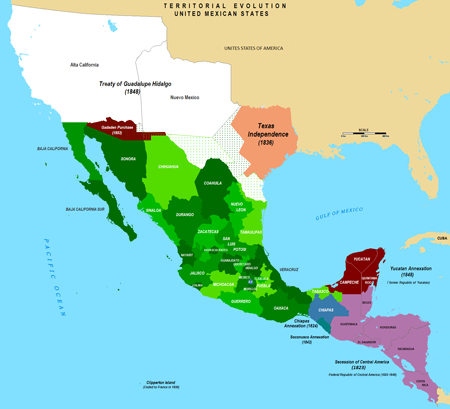
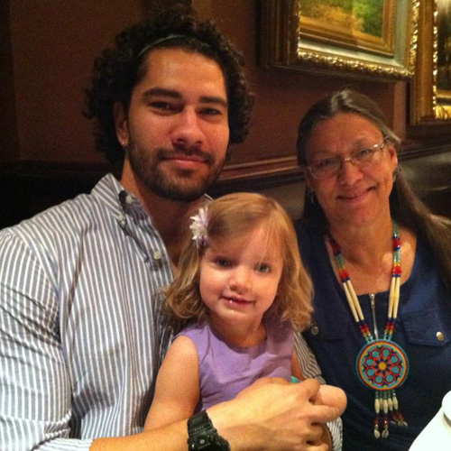
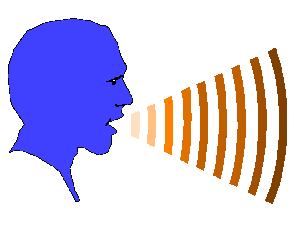
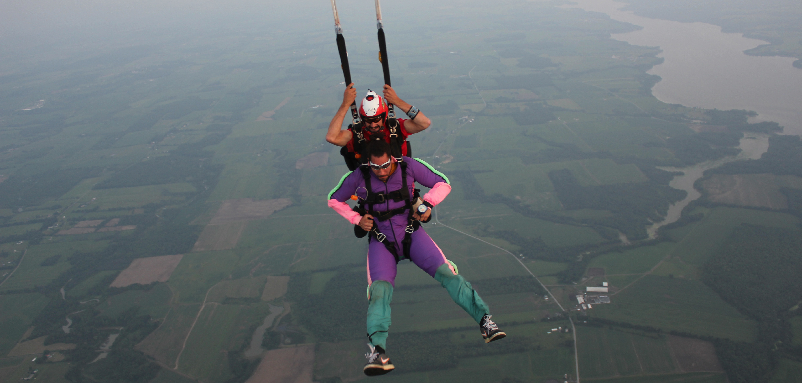
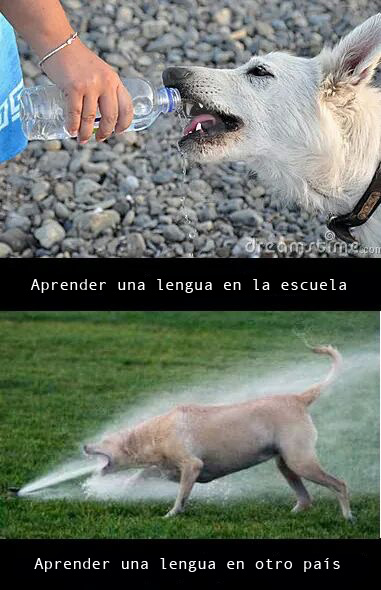

## Mi nombre es Joseph Casillas.

  

---

## Soy de Arizona.

  

---

## Tengo una perra.

  

---

## Mi Padre.

  

---

  

---

  
  

---

## Mi madre.

  

---

  

---

  

---

## Soy lingüista.

  
  
  

---

## Estudio el bilingüismo y la adquisición de segundas lenguas.

  

---

## También enseño en Middlebury College.

  

---

## Me gusta el fútbol. 

  

---

## Con un compañero...

  

> - Contesta las siguientes preguntas  
	- ¿De dónde eres?
	- ¿Qué estudias?
	- ¿Dónde estudias?
  - ¿Tienes alguna mascota?
> - ¿Alguna pregunta para mí?

---

## Con un compañero nuevo...

  

- Pregúntale tres cosas **nuevas** y cuéntanoslas

--- .segue bg:grey

# Introducción al curso

---

## El plan

  

> - ¿Qué vais a aprender?

> - ¿Cómo lo vamos a hacer? El programa.

> - Sugerencias para tener éxito.

---

## Objetivos

  
  

> - Desarrollar y controlar las estructuras básicas de gramática

> - Ampliar el vocabuario

> - Consolidar la habilidad de negociar situaciones básicas en español dentro de un contexto cultural 

> - Preparación para estudiar la lengua independientemente

---

## Objetivos

  
  

> - describir experiencias de la vida diaria (rutinas, actividades, etc.)
> - describir personas (familia, amigos, etc.) y lugares
> - narrar eventos en los tiempos del presente y del futuro
> - describir y reflexionar sobre los contrastes culturales
> - hacer preguntas para solicitar información 
> - presentar a la clase temas investigados y contestar preguntas
> - dar instrucciones y direcciones

---

## 

  

---

## Algunas sugerencias

> - Habla siempre español 
> - Haz muchas preguntas. 
> - No tengas miedo de hacer errores; lo que importa es la comunicación. 
> - Pide ayuda cuando estés confundido/a.
> - Ven a clase con la tarea preparada. 
> - No asumas nada, pídele al profesor que confirme las expectativas. 
> - Participa activamente en clase; procura hablar por lo menos 10 minutos en cada clase. 

---

## Más sugerencias

> - Lee mucho en español. La lectura es muy buena para desarrollar la producción oral. 
> - Escucha la radio en español. 
> - Escucha música en español. 
> - Ve a todas las películas de la escuela española. 
> - **Participa en muchas actividades co-curriculares.**
> - Habla con otros profesores y con estudiantes de todos los niveles.
> - Estudiar (pero ¡no demasiado!)
> - ¡Diviértete!

---

## El programa

