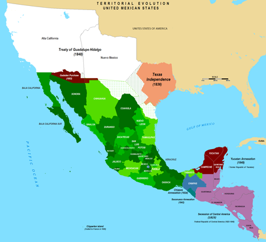
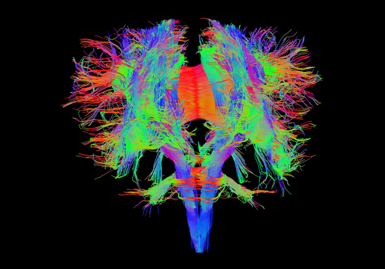

## Mi nombre es Joseph Casillas.

  

---

## Soy de Arizona.

  

---

## Tengo una perra.

  

---

## Mi Padre.

  

---

  

---

  
  

---

## Mi madre.

  

---

  

---

  

---

## Soy lingüista.

  
  
  

---

## Estudio el bilingüismo y la adquisición de segundas lenguas.

  

---

## También enseño en Middlebury College.

  

---

## Me gusta el fútbol. 

  

---

## Con un compañero...

  

> - Contesta las siguientes preguntas  
	- ¿De dónde eres?
	- ¿Qué estudias?
	- ¿Dónde estudias?
  - ¿Tienes alguna mascota?
> - ¿Alguna pregunta para mí?

---

## Con un compañero nuevo...

  

- Pregúntale tres cosas **nuevas** y cuéntanoslas

--- .segue bg:grey

# Introducción al curso

---

## El plan

  

> - ¿Qué vais a aprender?

> - Sugerencias para tener éxito.

> - ¿Cómo lo vamos a hacer? El programa.

> - Introducción a la lingüística

---

## Objetivos

  
  

> - Desarrollar y controlar las estructuras básicas de la fonética/fonología 
española

> - Reconocer y aprecial la diversidad lingüística del mundo hispánico

> - Preparación para seguir desarrollando L2 en el futuro

> - ¿Cuáles son algunos de vuestros objetivos para:
	- este semestre?
	- está clase?

---

## 

  

---

## Algunas sugerencias

> - Hablad siempre español 
> - Haced muchas preguntas. 
> - No tengáis miedo de hacer errores; lo que importa es la comunicación. 
> - Pedid ayuda cuando estéis confundidos/as.
> - Venid a clase con la tarea preparada. 
> - No asumáis nada, pedidle al profesor que confirme las expectativas. 
> - Participad activamente en clase

---

## Más sugerencias

> - Leed mucho en voz alta. La lectura es buena para desarrollar la producción oral. 
> - Escuchad la radio en español. 
> - Escuchad música en español. 
> - **Participad en muchas actividades fuera de clase**
> - Hablad con otros profesores y con estudiantes de todos los niveles.
> - Estudiad (pero ¡no demasiado!)
> - ¡Divertiros!

---

## El programa

