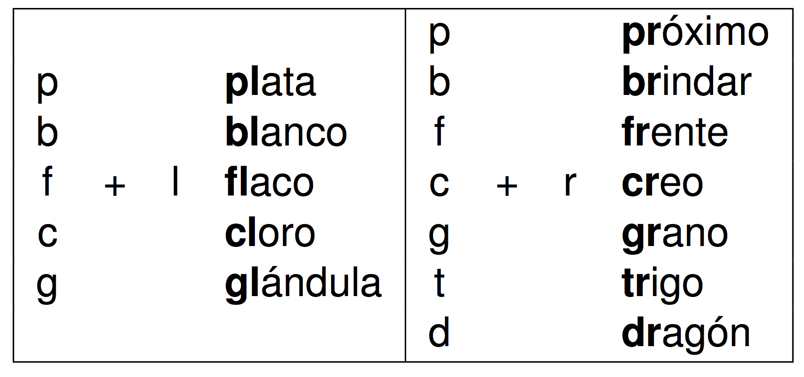

## La lingüística

### Pensad...

>- ¿Qué es la lingüística? ¿Puedes dar una definición?
- ¿Cuáles son las ramas de la lingüística?
- ¿Cuál es la diferencia entre un análisis descriptivo y un análisis prescriptivo? 
- ¿De qué tipo de análisis se ocupa la lingüística?
- ¿Qué es más importante para los lingüistas: la escritura o el habla? ¿Por qué?

---

## Las ramas de la lingüística

  

---

## Los grafemas, los dígrafos y los fonemas

>- **Los grafemas**: las letras del alfabeto, lo que usamos para escribir.
- **Los dígrafos**: la combinación de dos grafemas para representar un sólo sonido.
	- ej. “c”, “l”, “r”
	- ej. “ch”, “ll”, “rr”

---

## Los grafemas, los dígrafos y los fonemas

- **Los grafemas**: las letras del alfabeto, lo que usamos para escribir.
- **Los dígrafos**: la combinación de dos grafemas para representar un sólo sonido. 
  - ej. “c”, “l”, “r”
  - ej. “ch”, “ll”, “rr”

 

  

---

## Los grafemas, los dígrafos y los fonemas

>- Existen 27 grafemas y 3 dígrafos en español
- Es decir, el alfabeto consiste en 30 letras

---

## Los grafemas, los dígrafos y los fonemas

- **Los grafemas**: las letras del alfabeto, lo que usamos para escribir.
- **Los dígrafos**: la combinación de dos grafemas para representar un sólo sonido.
- **Los fonemas**: las unidades de sonido

---

## Los fonemas

- **Los fonemas**: las unidades de sonido
- Al escribir, utilizamos los grafemas y los dígrafos para comunicarnos.
- Para representar por escrito las unidades de sonido de una lengua dada, utilizamos los fonemas, los cuales escribimos mediante los símbolos del Alfabeto Fonético Internacional (AFI, o IPA en inglés)

---

## Los fonemas

- En la fonética, los grafemas y los dígrafos se escriben entre comillas
- En cambio, los fonemas se escriben entre barras

  

--- .segue bg:grey

# La sílaba y el silabeo

---

## El silabeo

### Lo básico...

>- El silabeo es cómo separamos las palabras por sílabas (silabificación)
- Cada sílaba debe tener un núcleo
- El núcleo puede ser o bien una vocal o bien un diptongo
- Agrupamos las consonantes alrededor del núcleo

---

## El silabeo

>- En español, existe una estructura silábica preferida
- Es decir, las sílabas tienden a configurarse de una manera determinada

---

## El silabeo

 

  

---

## El silabeo

  

---

## El silabeo

Sin embargo, sabemos que existen muchas otras estructuras silábicas en español...

|        |            |
| :----- | :--------- |
| -v-    | a-e-re-o   |
| -vc-   | al-go      |
| -vcc-  | obs-tan-te |
| -cv-v- | te-a-tro   |

---

## El silabeo

Sin embargo, sabemos que existen muchas otras estructuras silábicas en español...\\

|          |         |
| :------- | :------ |
| -cdv-cv  | cie-go  |
| -cvd-cv  | pei-ne  |
| -cdvc-cv | tien-da |
| -ccdv-cv | prue-ba |

 

>- ¿Cómo se forma una sílaba? 

---

## El núcleo vocálico

  

---

## El núcleo vocálico

  

---

## El núcleo vocálico

  

---

## El núcleo vocálico

  

---

## Los grupos consonánticos

Lo fundamental para poder silabificar **cualquier** palabra en español es saber los posibles grupos consonánticos  

>- **Grupo consonántico**: Una serie de dos o más consonantes
	- Ciertas consonantes pueden combinarse 
	- Otras son incompatibles dentro de una sílaba

---

## Las combinaciones permitidas

  

---

## Las combinaciones permitidas

  

---

## A practicar...

  

> - leer
- construcción
- desarreglado
- maestro
- también
- manchar
- adyacente
- influencia

--- &twocol

## A practicar...

*** {name: left}

- leer
- construcción
- desarreglado
- maestro
- también
- manchar
- adyacente
- influencia

*** {name: right}

- le.er
- cons.truc.ción
- de.sa.rre.gla.do
- ma.es.tro
- tam.bién
- man.char
- ad.ya.cen.te
- in.fluen.cia

  

--- .segue bg:grey

# Los monoptongos y los diptongos

---

## Los monoptongos

>- **Monoptongo**: Una sílaba compuesta por una vocal.

### Ejemplos

- “casa” ===> /ˈka.sa/
- “taburete” ===> /ta.bu.ˈre.te/

---

## Los diptongos

>- **Diptongo**: La secuencia de dos vocales seguidas (una vocal y una deslizada) en una sola sílaba.

### Ejemplos

- “can**ción**”  “can.**ción**” ===>  /kan.**ˈsi̯on**/
- “**puer**ta”   “**puer**.ta”  ===>  /**ˈpu̯er**.ta/

---

## Los diptongos

- **Diptongo**: La combinación de dos vocales (una vocal y una deslizada) en una sola sílaba.

 

- Hay 3 tipos de diptongos
- Se clasifican según las vocales que contengan

---

## Tipos de diptongos

### 3 tipos de diptongos

>- **Diptongo creciente**: Vocal débil en posición inicial
- **Diptongo decreciente**: Vocal débil en posición final
- **Diptongo acreciente**: Dos vocales débiles (distintas) juntas

---

## Clasificación de las vocales

  

---

## Clasificación de las vocales

  

---

## Clasificación de las vocales

  

 

>- **Cuanto más abierta, más enegría**

---

## Los diptongos crecientes

|     |              |             |     |
| :-- | :----------- | :---------- | :-- |
| ie  | ej. “sierra” | /si̯é.ra/   |     |
| ia  | ej. “piano”  | /pi̯á.no/   |     |
| io  | ej. “idiota” | /i.di̯ó.ta/ |     |
| ue  | ej. “cuento” | /ku̯én.to/  |     |
| ua  | ej. “cuadro” | /ku̯á.dro/  |     |
| uo  | ej. “cuota”  | /ku̯ó.ta/   |     |

 

-  débil          ===>  fuerte      
-  cerrada        ===>  abierta     
-  menos energía  ===>  más enegría 

---

## Los diptongos decrecientes

|       |                      |                         |
| :---- | :------------------- | :---------------------- |
| ei/ey | ej. “reina” “rey”    | /réi̯.na/ /rei̯/        |
| ai/ay | ej. “traigo” “caray” | /trái̯.go/ /ka.rái̯/    |
| oi/oy | ej. “oigo” “voy”     | /ói̯.go/ /boi̯/         |
| eu    | ej. “deuda”          | /déu̯.da/               |
| au    | ej. “jaula”          | /xáu̯.la/               |
| ou    | ej. “genitourinario” | /xe.ni.tou̯.ri.ná.ri̯o/ |

 

-  débil          ===>  fuerte      
-  cerrada        ===>  abierta     
-  menos energía  ===>  más enegría 

---

## Los diptongos acrecientes

|       |                     |                                |
| :---- | :------------------ | :----------------------------- |
| iu    | ej. “ciudad”        | /si̯u.dád/ o /sju.dád/         |
| ui/uy | ej. “buitre”, “muy” | /bu̯í.tre/ o /bwí.tre/, /mui̯/ |

 

-  débil          ===>  fuerte      
-  cerrada        ===>  abierta     
-  menos energía  ===>  más enegría 

---

## ¿Monoptongo o diptongo?

### Transcribid las siguientes palabras y determinad si contienen un diptongo:

1. aprueba
1. belleza
1. cubierto
1. gobernante
1. devuelto
1. volver
1. averiguar
1. cueva
1. soberbio
1. habitual

---

## ¿Monoptongo o diptongo?

### Transcribid las siguientes palabras y determinad si contienen un diptongo:

1. /a.pru̯é.ba/
1. /be.ʝé.sa/
1. /ku.bi̯ér.to/
1. /go.ber.nán.te/
1. /de.bu̯él.to/
1. /bol.bér/
1. /a.be.ri.gu̯ár/
1. /ku̯é.ba/
1. /so.bér.bi̯o/
1. /a.bi.tu̯ál/

---

## Vocal vs. deslizada

- **Las vocales**: /i/ /e/ /a/ /o/ /u/
- **Las deslizadas**: /i̯/ /u̯/

 

- Las deslizadas cuentan con una duración más corta. 

---

## Las vocales

  

---

## Las vocales

  

---

## Las vocales

  

---

## Las vocales

  

---

## Las vocales

  

--- .segue bg:grey

# Los hiatos

---

## Los hiatos

- **Hiato**: La secuencia de dos vocales seguidas que se separan en dos sílabas

### Ejemplos 

- área /ˈa.ɾe.a/
- héroe /ˈe.ɾo.e/

---

## Los hiatos

  
  

- **Hiato** La secuencia de dos vocales seguidas que se separan en dos sílabas

### Ejemplos 

- área /ˈa.ɾe.a/
- héroe /ˈe.ɾo.e/

---

## Lo que hemos visto...

### Conceptos:

- la lingüística
- grafema/dígrafo vs. fonema
- la sílaba
	- composición (ataque, núcleo, coda)
	- grupos consonánticos
- monoptongos
- diptongos (3 tipos)
- hiatos 

---

## Para mañana...

### Estudiad:

- los resúmenes de hoy
- los resúmenes para mañana

