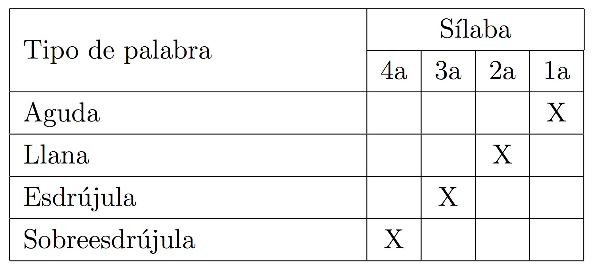

## Repaso

### Las sílabas

- ¿Qué es una sílaba? ¿De qué está compuesta?
- ¿Qué es un diptongo? ¿De qué está compuesto?
- ¿Qué es un hiato? ¿De qué está compuesto?

 

### Las vocales

- ¿Cuáles son algunas de las características de las vocales del inglés? ¿Del español?
- ¿Qué le recomendarías a un amigo para que mejorase su pronunciación?

---

## Repaso

Dividir por sílabas las siguientes palabras...

- casa     
- calle    
- hacha    
- alto     
- limpio   
- anécdota 
- España   
- aplauso  

--- &twocol

## Repaso

Dividir por sílabas las siguientes palabras...

*** {name: left}

- casa    
- calle   
- hacha   
- alto    
- limpio  
- anécdota
- España  
- aplauso 

 

> - Ahora transcribidlas...

*** {name: right}

- ca.sa
- ca.lle
- ha.cha
- al.to 
- lim.pio
- a.néc.do.ta
- Es.pa.ña
- a.plau.so

---

## Repaso

Dividir por sílabas las siguientes palabras...

| Palabra  | Silabificación | Transcripción fonémica |
| :------- | :------------- | :--------------------- |
| casa     | ca.sa          | /ˈka.sa/               |
| calle    | ca.lle         | /ˈka.ʝe/               |
| hacha    | ha.cha         | /ˈa.ʧa/                |
| alto     | al.to          | /ˈal.to/               |
| limpio   | lim.pio        | /ˈlim.pi̯o/            |
| anécdota | a.néc.do.ta    | /a.ˈnek.do.ta/         |
| España   | Es.pa.ña       | /es.ˈpa.ɲa/            |
| aplauso  | a.plau.so      | /a.ˈplau̯.so/          |

--- .segue bg:grey

# Correspondencia exclusiva

---

## Correspondencia exclusiva

### **Correspondencia exclusiva**: La relación entre el grafema y el fonema es 1:1. 

> - Es decir, el grafema es representado por un sólo fonema y el fonema es respresentado por un sólo grafema.
> - Hay 9 casos de correspondencia exclusiva en español.

---

## Correspondencia exclusiva

|     | Grafema/Dígrafo | Fonema |
| :-- | :-------------- | :----- |
|     | "a"             | /a/    |
|     | "e"             | /e/    |
|     | "o"             | /o/    |
|     | "ch"            | /ʧ/    |
|     | "d"             | /d/    |
|     | "f"             | /f/    |
|     | "l"             | /l/    |
|     | "p"             | /p/    |
|     | "t"             | /t/    |

<!-- 

  </img>

 -->

---

## Correspondencia exclusiva

|     | Grafema/Dígrafo |                                 | Fonema |
| :-- | :-------------- | :------------------------------ | :----- |
|     | "a"             | **⟵-----------------------⟶** | /a/    |
|     | "e"             | **⟵-----------------------⟶** | /e/    |
|     | "o"             | **⟵-----------------------⟶** | /o/    |
|     | "ch"            | **⟵-----------------------⟶** | /ʧ/    |
|     | "d"             | **⟵-----------------------⟶** | /d/    |
|     | "f"             | **⟵-----------------------⟶** | /f/    |
|     | "l"             | **⟵-----------------------⟶** | /l/    |
|     | "p"             | **⟵-----------------------⟶** | /p/    |
|     | "t"             | **⟵-----------------------⟶** | /t/    |

<!-- 

  </img>

 -->

---

## Correspondencia exclusiva

>- La correspondencia entre grafema/dígrafo y fonema no es exclusiva en todos los casos.
- Dicho de otra manera, no siempre es una relación de 1:1  
	- Ej. las 21 letras que quedan...
- ¿Qué problemas puede crear este hecho?

---

## Correspondencia NO exclusiva

 

  </img>

---

## Correspondencia NO exclusiva

 

  </img>

### Ej. 

- /k/: casa
- /s/ o /θ/: cien

---

## Correspondencia NO exclusiva

 

  </img>

---

## Correspondencia NO exclusiva

 

  </img>

### Ej.

- cabe (inf. *caber*): /ˈka.be/
- cave (inf. *cavar*): /ˈka.be/

---

## Resumen - Tipos de correspondencia

  </img>

---

## Tipos de correspondencia

- En grupos de dos o tres pensad en otros ejemplos de correspondencia NO exclusiva. 
- Puede ser de un grafema/dígrafo a varios fonemas o de varios grafemas a un fonema.

> - Ej. 
	- /k/ ⟶ "c", "k", "qu"
	- "**c**asa", "**k**ilo", "**qu**e"

--- .segue bg:grey

# La letra "x"

---

## La letra "x"

### Decid las siguientes palabras

- examen
- éxito
- texto
- extra

 

>- ¿Cuántos sonidos escucháis para la letra "x"?
- ¿Cuántos fonemas hay?

---

## La letra "x"

- "x" ⟶ /ks/
- Son dos sonidos distintos

### Según el contexto fónico, hay dos posibilidades:

>1. o bien los dos sonidos pueden formar una coda compleja (/ks/) 
>2. o bien el sonido fricativo (/s/) puede ir en el arranque de la siguiente sílaba (/k.s/)

---

## La letra "x"

- "x" ⟶ /ks/
- Son dos sonidos distintos

### Según el contexto fónico, hay dos posibilidades:

1. o bien los dos sonidos pueden formar una coda compleja (/ks/) 
2. o bien el sonido fricativo (/s/) puede ir en el arranque de la siguiente sílaba (/k.s/)

### Transcribid las siguientes palabras...

| Otrografía | Transcripción |
| :--------- | :------------ |
| examen     |               |
| éxito      |               |
| texto      |               |
| extra      |               |

---

## La letra "x"

- "x" ⟶ /ks/
- Son dos sonidos distintos

### Según el contexto fónico, hay dos posibilidades:

1. o bien los dos sonidos pueden formar una coda compleja (/ks/) 
2. o bien el sonido fricativo (/s/) puede ir en el arranque de la siguiente sílaba (/k.s/)

### Transcribid las siguientes palabras...

| Otrografía | Transcripción |
| :--------- | :------------ |
| examen     | /ek.sá.men/   |
| éxito      | /ék.si.to/    |
| texto      | /téks.to/     |
| extra      | /éks.tra/     |

--- .segue bg:grey

# Precalentamiento

---

## Transcripción a la inversa

| Transcripción fonémica | Palabra |
| :--------------------- | :------ |
| /ˈpa.xi.na/            |         |
| /re.ko.ˈxeɾ/           |         |
| /u.ˈma.no/             |         |
| /xen.ˈtil/             |         |
| /ˈθin.ko/              |         |
| /ˈle.ʧe/               |         |
| /ra.ˈton/              |         |
| /o.ʧo.ˈθi̯en.tos/      |         |
| /xa.po.ˈne.sa/         |         |
| /ˈge.ra/               |         |

---

## Transcripción a la inversa

| Transcripción fonémica |    Palabra    |
| :--------------------- | :------------ |
| /ˈpa.xi.na/            | "página"      |
| /re.ko.ˈxeɾ/           | "recoger"     |
| /u.ˈma.no/             | "humano"      |
| /xen.ˈtil/             | "gentil"      |
| /ˈθin.ko/              | "cinco"       |
| /ˈle.ʧe/               | "leche"       |
| /ra.ˈton/              | "ratón"       |
| /o.ʧo.ˈθi̯en.tos/      | "ochocientos" |
| /xa.po.ˈne.sa/         | "japonesa"    |
| /ˈge.ra/               | "guerra"      |

--- .segue bg:grey

# Semivocales y vocales

---

## Las semivocales (deslizadas)

### [ i̯ ] - [ u̯ ]

- más breves que las vocales; se 'deslizan' hacia el sonido vocálico
- no pueden ir solas (sin una vocal que las acompañe)
- no pueden comenzar una sílaba
- no pueden llevar acento

---

## Las vocales

### [i] - [u] ...(y las demás)

- más largas que las semivocales (deslizadas)
- pueden ir solas
- pueden comenzar una sílaba 
- pueden llevar acento

---

## Semivocales y vocales

### Representación ortográfica de las semivocales (letras)

### [ i̯ ]

- "i" adiós ⟶ /a.ˈdi̯os/
- "y" hay ⟶ /ai̯/

 

### [ u̯ ]

- "u" suave ⟶ /su̯a.be/
- "ü" lingüista ⟶ /lin.ˈgu̯is.ta/

--- .segue bg:grey

# [ʝ] y [w]

---

## [ʝ] y [w]

- Son consonantes fricativas
- También se denominan "semiconsonantes"
- Están íntimamente relacionadas con las semivocales (/i̯ u̯/)
- Siempre van en el arranque 
- Las semivocales no pueden ir en el arranque
- Lo que tenemos en su lugar es [ʝ] y [w]

 

| Ortografía | Transcripción |     ¡MAL!      |
| :--------: | :-----------: | :------------: |
|   hielo    |    [ʝé.lo]    | \***[i̯elo]**  |
|   huerta   |    [wér.ta]   | \***[u̯erta]** |

---

## [ʝ] y [w]

### También corresponden a las letras 'll', 'y' y 'w'

 

| Ortografía | Transcripción |
| :--------- | :------------ |
| llamar     | /ʝa.ˈmar/     |
| payaso     | /pa.ˈʝa.so/   |
| whisky     | /ˈwis.ki/     |

---

## [ʝ] y [w]

### Se relacionan con las vocales [i] y [u] y con las semivocales [ i̯ ] y [ u̯ ]

- Semejanzas: articulación
- Diferencias:

 

|              |            |                 |             |
| :----------- | :--------- | --------------- | ----------- |
| [ʝ] - [w]:   | + fricción | + deslizamiento | - nucleares |
| [i̯] - [u̯]: | - fricción | + deslizamiento | - nucleares |
| [i] - [u]:   | - fricción | - deslizamiento | + nucleares |

> - Hay lingüistas que transcriben todos los diptongos con semiconsonantes
    - "suave" ⟶ /ˈswa.be/
    - "lingüista" ⟶ /lin.ˈgwis.ta/

---

## [ʝ] y [w]

### Recuerda: las semivocales son más breves que las vocales; las consonantes tienen fricción

 

| Sonido | Letra | Ejemplo | Transcripción fonémica |
| :----- | :---- | :------ | :--------------------- |
| [ʝ]    | "y"   | yo      | /ʝo]                   |
|        | "ll"  | calle   | /ˈka.ʝe/               |
|        | "i"   | hielo   | /ˈʝe.lo/               |
| [w]    | "w'"  | whisky  | /ˈwis.ki/              |
|        | "u'"  | huerta  | /ˈweɾ.ta/              |

--- .segue bg:grey

# El acento

---

## Acento prosódico vs. acento ortográfico

>- **Acento prosódico**: La sílaba más fuerte (más pronunciada) de la palabra
- **Acento ortográfico**: La tilde escrita sobre una vocal para denotar el acento prosódico

### No todas las palabras cuentan con un acento ortográfico (la tilde), pero sí **TODAS** tienen acento prosódico.

| Palabra | Transcripción fonémica |
| :------ | :--------------------- |
| "casa"  | /ˈka.sa/               |
| "móvil" | /ˈmo.bil/              |

---

## El acento ortográfico

  </img>
  </img>

- Las palabras en español se denominan de manera diferente dependiendo de la sílaba en la que cae el acento primario de la palabra. 
    - agudas
    - llanas
    - esdrújulas
    - sobreesdrújulas

---

## El acento ortográfico

|  Tipo de palabra   |                         Descripción                         |          Ejemplos          |
| :----------------- | :---------------------------------------------------------- | :------------------------- |
| **Agudas**         | Llevan el acento prosódico en la última sílaba              | "fatal", "capaz"           |
| **Llanas**         | Llevan el acento prosódico en la penúltima sílaba           | "casa", "hermano"          |
| **Esdrújulas**     | Llevan el acento prosódico en la antepenúlima sílaba        | "sábana", "esdrújula"      |
| **Sobreesdrújulas** | Llevan el acento prosódico antes de la antepenúltima sílaba | "dándoselo", "escríbemelo" |

 

  </img>

---

## Información general

  </img>
  </img>

- Todas las palabras esdrújulas y sobreesdrújulas llevan tilde (acento ortográfico) en la sílaba tónica... **todas**.
- Hay que aprender cuándo se tildan las agudas y las llanas
- La gran mayoría de las palabras en español son llanas
- La estructura silábica más común es CV.CV

---

## Dos tendencias generales
        
### Las palabras que terminan en vocal, "n" o "s" suelen ser llanas

- Ej. comen, casas, boca, hacen, buscamos...

### Las palabras que terminan en consonante (excepto “n” o “s”) suelen ser agudas

- Ej. fatal, total, hacer, feliz, perfil...

### <BLUE>Las palabras que respetan esta tendencia del español NO llevan acento gráfico/escrito.</BLUE>

---

## Regla para la acentuación

### REGLA UNIVERSAL

- Las palabras llanas y agudas que no siguen la tendencia general llevan una tilde en la vocal tónica de la palabra.

---

## A practicar

### Explicad por qué las siguientes palabras requieren o no una tilde...

| Transcripción fonémica | Palabra | Explicación |
| :--------------------- | :------ | :---------- |
| /a.ˈo.ɾa/              |         |             |
| /ˈbes.tia/             |         |             |
| /es.ˈdru.xu.la/        |         |             |
| /ˈpru̯e.ba/            |         |             |
| /ka.ˈfe/               |         |             |

---

## A practicar

### Explicad por qué las siguientes palabras requieren o no una tilde...

| Transcripción fonémica |   Palabra   |              Explicación               |
| :--------------------- | :---------- | :------------------------------------- |
| /a.ˈo.ɾa/              | "ahora"     | No, porque es llana y termina en vocal |
| /ˈbes.tia/             | "bestia"    | No, porque es llana y termina en vocal |
| /es.ˈdru.xu.la/        | "esdrújula" | Sí, porque es esdrújula                |
| /ˈpru̯e.ba/            | "prueba"    | No, porque es llana y termina en vocal |
| /ka.ˈfe/               | "café"      | Sí, porque es aguda y termina en vocal |

---

## El antidiptongo

### Considerad las siguientes palabras

- prohíbo
- día
- oír
- Raúl
- continúa
- leíste
- tenía

---

## Las palabras monosilábicas

- Las palabras monosilábicas en español no llevan tilde, excepto en los casos de homonimia
- La tilde sirve para diferenciar entre homónimos, palabras ortográficamente idénticas pero con significado diferente

### Ej. 

- de/dé
- mi/mí
- si/sí
- tu/tú
- mas/más...

---

## ¡Ya está! Ahora sabes poner bien las tildes

 

  </img>

--- .segue bg:grey

# Repaso

--- &twocol

## Lo que hemos visto...

*** {name: left}

- la lingüística y las distintas ramas
- grafema/dígrafo vs. fonema
- la sílaba
  - composición (ataque, núcleo, coda)
  - grupos consonánticos
- monoptongos
- diptongos (3 tipos)
- hiatos 
- diferencias entre el inglés y el español (vocales)

*** {name: right}

- correspondencia absoluta/exclusiva
- semivocales/semiconsonantes
- el grafema "x"
- los fonemas [ʝ] y [w]
- el acento ortográfico
- el acento prosódico

---

## Tarea

- Para entregar (el martes), hoja impresa

