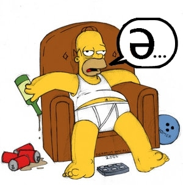
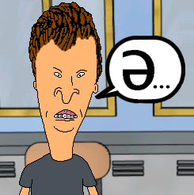
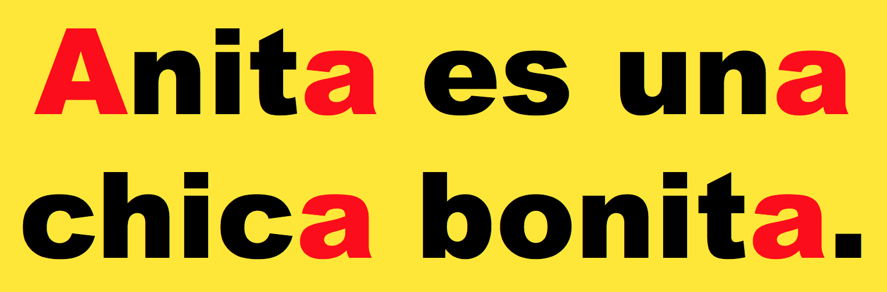
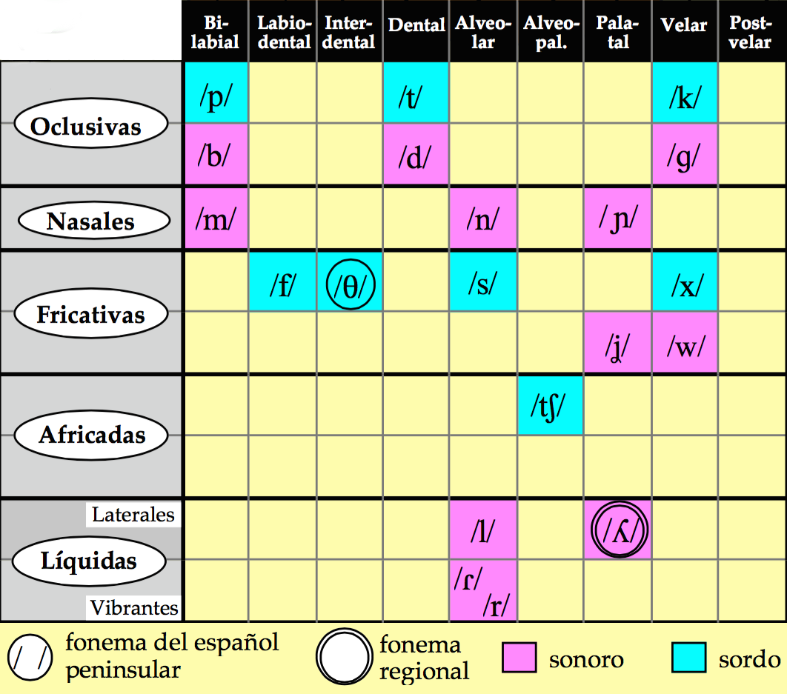

## En grupos de tres discutid las siguientes preguntas

1. ¿Qué lenguas hablas?
1. ¿Cómo y dónde has aprendido a hablar el español?
1. ¿Qué significa ser bilingüe?
1. ¿Cuál es la relación que tienes con los dos idiomas? ¿Eres bilingües? ¿Cómo caracterizarías tu bilingüismo? 
1. ¿Cuál es tu actitud y/o sentimientos hacia el español?
1. ¿Qué es lo que más te gusta del idioma español?
1. Si pudieras cambiar algo sobre la lengua, ¿que sería?
1. ¿Qué planes tienes para tu futuro con las lenguas que hablas o la lingüística?

--- .segue bg:grey

# Sílabas, vocales y ritmo

--- &twocol

## El encadenamiento

> - Tenemos una estructura sílabica preferida (CV.CV)
- Se mantiene tanto en el interior de la palabra como **entre palabras**

 

*** {name: left}

- amigo      
- coche      
- el otro
- en el coche
- al amigo   
- buen año   

*** {name: right}

>- a.mi.go       
>- co.che        
>- e.**l**o.tro
>- e.**n**el.co.che 
>- a.**l**a.mi.go    
>- bue.**n**a.ño     

---

## El encadenamiento

- Un fenómento característico del inglés es *el golpe de glotis* como 
sonido consonántico (/ʔ/) [katy perry](https://youtu.be/Q-zh7IKCciQ)  

<audio controls>
  <source src="../../libraries/assets/videos/perry_glotis.ogg" type="audio/ogg">
  <source src="../../libraries/assets/videos/perry_glotis.wav" type="audio/mpeg">
Your browser does not support the audio element.
</audio>

- Este sonido no existe en español 
- Debéis evitarlo para mejorar la pronunciación
- Escencialmente lo que hay que hacer es pronunciar cada enunciado como 
si fuese **una** palabra

### ¿Cómo se hace?

> - maximizando el arranque
> - manteniendo la estructura silábica preferida **entre palabras**

--- &twocol

## Ejemplos

*** {name: left}

- un amigo
- el amigo
- tus amigos
- sus amigos
- los amigos
- dos hermanos
- los ángeles
- en este

*** {name: right}

>- u.na.mi.go
- e.la.mi.go
- tu.sa.mi.gos
- su.sa.mi.gos
- lo.sa.mi.gos
- do.ser.ma.nos
- lo.sán.ge.les
- e.nes.te

--- &twocol

## Más ejemplos

*** {name: left}

- Es una lástima
- ¿Piensas así?
- ¡Ven y báñate!
- Las instrucciones están aquí.
- Los amigos están en Oslo.
- Los abuelos viven ahí.
- En estos años es algo difícil ir.

*** {name: right}

>- e.su.na.lás.ti.ma
- ¿pien.sa.sa.sí?
- ¡ve.ny.bá.ña.te!
- la.sins.truc.cio.ne.ses.tá.na.quí
- lo.sa.mi.go.ses.tá.ne.nos.lo
- lo.sa.bue.los.vi.ve.na.í.
- e.nes.to.sa.ño.se.sal.go.di.fí.ci.lir

---

## El encadenamiento

### Secuencias de vocales entre palabras

- Una secuencia de 'u, i' y otra vocal (el orden no importa) se convierte en un diptongo en el habla rápida

| Habla lenta | Habla rápida |  Transcripción  |
| :---------- | :----------- | :-------------- |
| su. amigo   | sua.mi.go    | [su̯a].mi.go    |
| mi. amigo   | mia.mi.go    | [mi̯a].mi.go    |
| su. enemigo | su enemigo   | [su̯e].ne.mi.go |
| mi. enemigo | mi enemigo   | [mi̯e].ne.mi.go |
| su. oso     | suo.so       | [su̯o].so       |
| mi. oso     | mio.so       | [mi̯o].so       |

---

## El encadenamiento

Mi amigo y yo fuimos a ver a un amigo 

-  Habla lenta y cuidada:  
mi.a.mi.go.y.yo.fui.mos.a.ver.a.un.a.mi.go
- Habla rápida:  
mia.mi.goy.yo. fui.mo.sa.ve.rau.na.mi.go  
[mi̯a].mi.[goi̯].yo.fui.mo.sa.ve.[rau̯].na.mi.go

---

## El acento

### El acento prosódico

- ¿Qué es una sílaba tónica? 
- ¿Qué es una sílaba átona?
- ¿Cómo se identifica la sílaba tónica?
- ¿Cómo marcamos la sílaba tónica en una trascripción?

---

## La duración

### En español...

- las sílabas átonas y tónicas tienen la misma duración.  
    - Con.si.de.ra.ción
    - Ca.sa

### En inglés... 

- las sílabas tónicas son más largas
- las átonas se reducen en duración y calidad
    - **Tar**get (rojo = sílaba tónica)
    - a**no**ther (negro = schwas)

### Para mejorar la pronunciación: 

- no reducir vocales en español, mantener la calidad de las vocales átonas.
- Es decir, ¡evitar la scwha!

--- .segue bg:grey

  

# Más sobre la schwa

---

## ¿Qué es una scwha?

  

>- Es una vocal (/ə/) típica del inglés
- Representa un sonido *inacentuado* (aparece en sílabas átonas)
- Es el sonido más común del inglés americano
- Existe en la gran mayoría de las palabras
- Es vuestro <BLUE>ENEMIGO</BLUE>

--- 

## ¿Cómo de común? Identificad la schwa...

  

- animal, family
- the 
- open 
- travel
- item
- banana 
- about
- was
- above
- gallon
- dinosaur
- particular

--- 

## ¿Cómo de común? Identificad la schwa...

  

- an**i**mal, fam**i**ly
- th**e** 
- op**e**n 
- trav**e**l
- it**e**m
- b**a**nan**a** 
- **a**bout
- w**a**s
- **a**b**o**ve
- gall**o**n
- din**o**saur
- partic**u**lar

---

## Práctica

  

 
 

### Español

## ANITA

### Inglés

 
 

- Recordad: Queremos vocales **cortas** y **tensas**

---

## Práctica

 

  

---

## Práctica

  

- fam**a** 
- mus**a**
- tin**a** 
- mir**a**
- chup**a**
- Mayr**a** 
- mis**a**
- bes**a** 
- dig**a** 
- tuy**a** 
- habl**a**

---

## Práctica

  

- síl**a**b**a**
- p**ú**blico
- termin**a**
- s**u**plico 
- tercer**a**
- d**i**recto
- comid**a**
- c**a**torce
- describ**a**
- méd**i**co
- c**a**min**a**
- lágrim**a**

---

## El ritmo

- Español: Ritmo silábico 
    - depende del número de sílabas, tienen la misma duración
- Inglés: Ritmo acentual 
    - depende del número de sílabas tónicas

--- .segue bg:grey

# La transcripción

---

## La transcripción

- Transcribir es representar mediante signos alfabéticos (los fonemas) la cadena hablada. 
- En nuestro ámbito de estudio, la transcripción puede ser fonológica o fonética.

---

## La transcripción: fonológica vs. fonética

- **La transcripción fonológica**: refleja la expresión en el plano de *la lengua*, es decir, la constitución fonológica de la emisión lingüística. Se ocupa, por tanto, sólo de lo distintivo.
    - Ej. “brevedad”  =  /bre.be.dád/

---

## La transcripción: fonológica vs. fonética

- **La transcripción fonética**: refleja la expresión en el plano del *habla*, es decir, las variantes utilizadas por el hablante, independientemente de su valor distintivo.
    - Dicho de otra manera, es una representación escrita de los sonidos que pronunciamos.
        - Ej. “brevedad”  =  [bre.βe.ˈðað] 
        - Ej. “brevedad”  =  [bre.βe.ˈðaθ] 
        - Ej. “brevedad”  =  [bre.βe.ˈða]

---

## La transcripción fonética

### La transcripción fonética puede ser **estrecha** o **ancha**: 

- **transcripción estrecha**: intenta recoger la mayor cantidad posible de información fonética.
- **transcripción ancha**: anota sólo los rasgos que contribuyen a la significación.

 

La transcripción ancha será suficiente para los propósitos de nuestra clase.

---

## La transcripción

### Recordad

- Separamos todas las sílabas
- Siempre marcamos el acento prosódico de cada palabra (aunque no lleve tilde normalmente)
    - "casa" = /ˈka.sa/

--- .segue bg:grey

# Los fonemas

---

### Fonemas consonánticos

<!-- 
|            |         Bilabial        |   Labiodental    |   Interdental    |          Dental          |     Alveolar     |   Alveopalatal   | Palatal |           Velar           |
| :--------- | :---------------------: | :--------------: | :--------------: | :----------------------: | :--------------: | :--------------: | :-----: | :-----------------------: |
| oclusivas  | <BLUE>/p/<BLUE> **/b/** |                  |                  | <BLUE>/t/</BLUE> **/d/** |                  |                  |         |  <BLUE>/k/</BLUE> **/g/** |
| nasales    |         **/m/**         |                  |                  |                          |     **/n/**      |                  | **/ɲ/** |                           |
| fricativas |                         | <BLUE>/f/</BLUE> | <BLUE>/θ/</BLUE> |                          | <BLUE>/s/</BLUE> |                  | **/ʝ/** | <BLUE>/x/</BLUE>  **/w/** |
| africadas  |                         |                  |                  |                          |                  | <BLUE>/ʧ/</BLUE> |         |                           |
| laterales  |                         |                  |                  |                          |     **/l/**      |                  | **/ʎ/** |                           |
| vibrantes  |                         |                  |                  |                          | **/ɾ/** **/r/**  |                  |         |                           |
 -->

  

---

## A transcribir...

-  Con un compañero, transcribe las siguientes palabras
-  Usad vuestros apuntes para ayudaros

---

  

---

  

---

## Más práctica

|   Palabra    | Transcripción fonémica |
| :----------- | :--------------------- |
| Genocidio    |                        |
| Bendición    |                        |
| Vibración    |                        |
| Cacería      |                        |
| Guitarra     |                        |
| Enredado     |                        |
| Recital      |                        |
| Zoológico    |                        |
| Quitamanchas |                        |
| Chorizo      |                        |

---

## Más práctica

|   Palabra    | Transcripción fonémica |
| :----------- | :--------------------- |
| Genocidio    | /xe.no.ˈθi.di̯o/       |
| Bendición    | /ben.di.ˈθi̯on/        |
| Vibración    | /bi.bɾa.ˈθi̯on/        |
| Cacería      | /ka.θe.ˈɾi.a/          |
| Guitarra     | /gi.ˈta.ra/            |
| Enredado     | /en.re.ˈda.do/         |
| Recital      | /re.θi.ˈtal/           |
| Zoológico    | /θo.o.ˈlo.xi.ko/       |
| Quitamanchas | /ki.ta.ˈman.ʧas/       |
| Chorizo      | /ʧo.ˈɾi.θo/            |

---

## Las vibrantes

### /ɾ/ vs. /r/

- /ɾ/ ⟶ "r" (siempre)
- /r/ ⟶ "r" o "rr"

---

## Las vibrantes

### "r" = /r/ en los siguientes contextos...

- Al principio de palabra ("rico", "romántico")
- Tras los grafemas "l", "n", "s"
    - alrededor
    - Enrique
    - Israel

## A pensar

### Reflexionad sobre los siguientes aspectos y proporcionad ejemplos de:

- Un sonido que se represente con diferentes letras
- Letras que se pronuncien de diferentes maneras
- Letras que no se pronuncien
- Una letra que se pronuncie con dos sonidos juntos
- Un sonido que se represente con dos letras juntas

--- 

