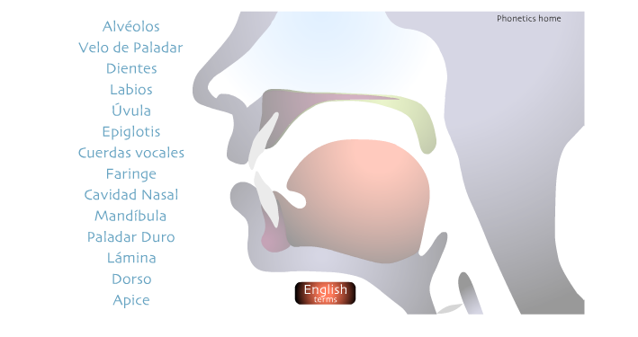
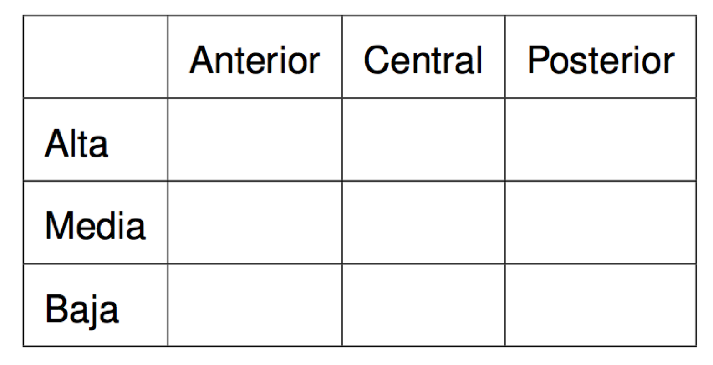
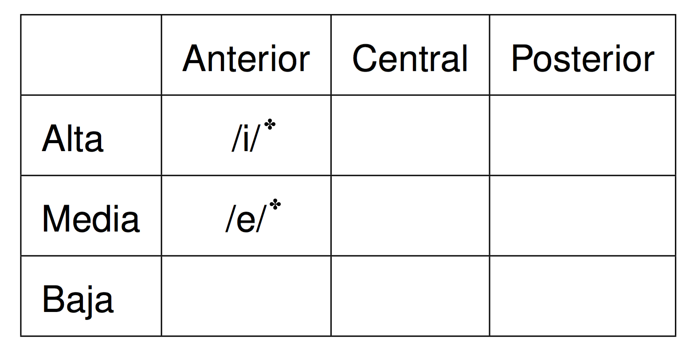
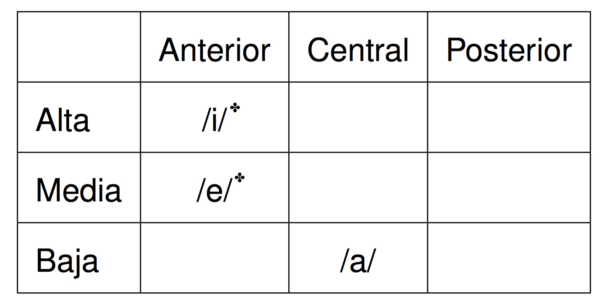

  

## Recordad...

### **Grafema**/**dígrafo** (letras): Entre comillas

- "a" 
- "ch"
- "ll"

### <BLUE>Fonema</BLUE> (sonidos): Entre barras

- /a/
- /ʧ/
- /ʝ/

--- .segue bg:grey

# El aparato fonador

---

## El aparato fonador

  

- **Aparato fonador**: las partes del cuerpo humano donde producimos los sonidos

---

## El aparato fonador

### Articulamos los sonidos con *los articuladores pasivos* y *los articuladores activos*
    
- **los articuladores pasivos**: los articuladores que *reciben* el contacto
- **los articuladores activos**: los articuladores que *producen* el contacto

---

## El aparato fonador

|     | Articuladores pasivos |            Articuladores activos             |
| :-- | :-------------------- | :------------------------------------------- |
|     | **Dientes**           | **Labios**: se abren/cierran/redondean       |
|     | **Zonja alveolar**    | **Lengua**: se retrae/adelanta/baja/sube     |
|     | **Zona palatal**      | **Mandíbula inferior**: se abre              |
|     |                       | **Úvula**: se extiende hacia atrás o se baja |

---

## Los articuladores pasivos

  

---

  
## Los articuladores pasivos

  

---

  
## Los articuladores pasivos

  

---

  
## Los articuladores activos

  

---

  
## Los articuladores activos

  

---

  
## Los articuladores activos

  

---

  
## Los articuladores activos

  

---

## Los articuladores en acción

<iframe width="420" height="315" src="https://www.youtube.com/embed/ZquuC1Nju3w" frameborder="0" allowfullscreen></iframe>

---

## ¿En qué se diferencian?

- **Las vocales**: ningún obstáculo a la salida del aire
- **Las consonantes**: algún tipo de obstáculo a la salida del aire

--- .segue bg:grey

# Los fonemas vocálicos

---

## Las vocales

### Las vocales monoptongales /a, e, i, o, u/:
  
### Clasificación:

- Posición de la lengua en dos ejes
    - horizontal
    - vertical

>- ¿Podemos decir que las vocales tienen un punto de articulación?

---

## Las vocales

<iframe width="420" height="315" src="https://www.youtube.com/embed/bOni5SLHmsI" frameborder="0" allowfullscreen></iframe>

---

## Las vocales

### Las vocales monoptongales /a, e, i, o, u/:
  
### Clasificación:

- Posición de la lengua en dos ejes 
    - horizontal 
    - vertical
- El redondeamiento de los labios

---

## Las vocales

  

---

## Las vocales

  

✤ <BLUE>estirada</BLUE>

---

## Las vocales

  

✤ <BLUE>estirada</BLUE>

---

## Las vocales

  

✤ <BLUE>estirada</BLUE>

---

## Las vocales

  

✤ <BLUE>estirada</BLUE>
\* <BLUE>redondeada</BLUE>

---

## Las vocales

  

✤ <BLUE>estirada</BLUE>
\* <BLUE>redondeada</BLUE>

---

## Las vocales

### Diferencias con respecto a las vocales del inglés (otra vez)

- Son cortas y tensas
- Nunca llegan a ser diptongos *por accidente*
- No se reducen

---

## Actividad

### Con un compañero, describid articulatoriamente las 5 vocales del español

- /i/
- /e/
- /a/
- /o/
- /u/

---

## Actividad

### Con un compañero, describid articulatoriamente las 5 vocales del español

- /i/: alta, anterior, estirada
- /e/: media, anterior, estirada
- /a/: baja, central
- /o/: media, posterior, redondeada
- /u/: alta, posterior, redondeada
