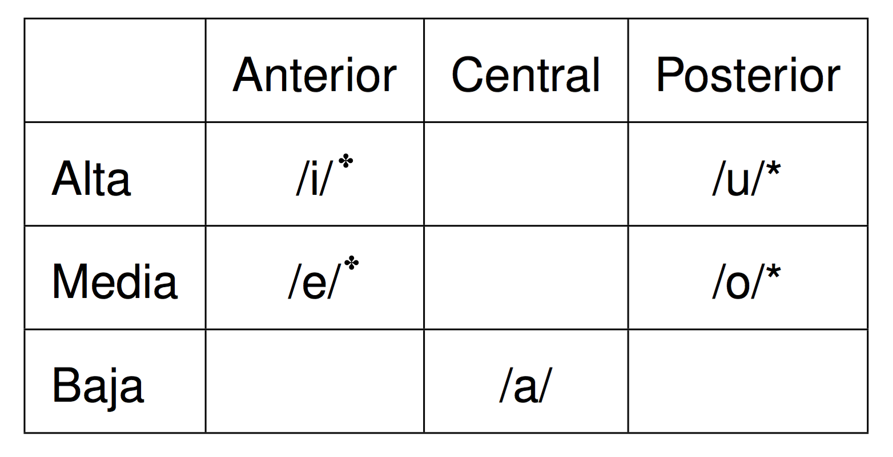
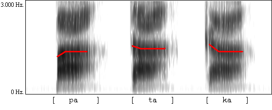
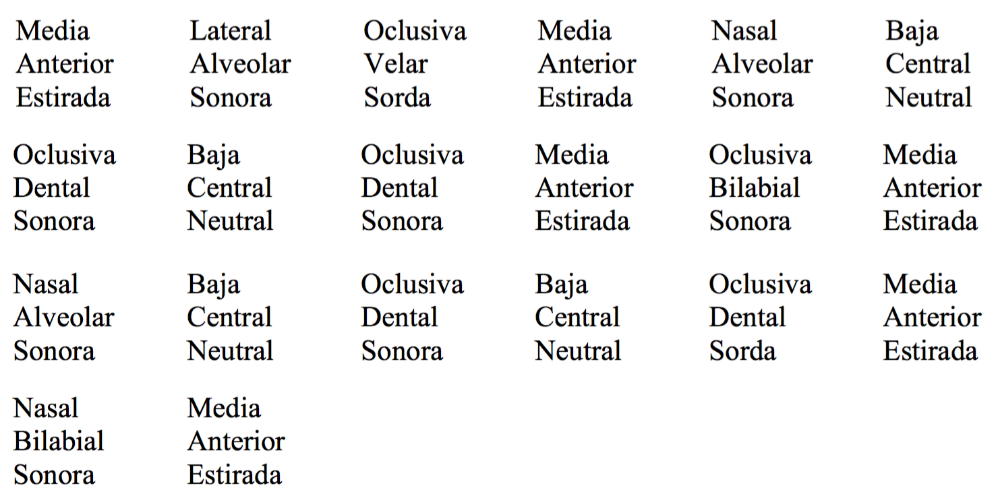

  

## Recordad...

### **Grafema**/**dígrafo** (letras): Entre comillas

- "a" 
- "ch"
- "ll"

### <BLUE>Fonema</BLUE> (sonidos): Entre barras

- /a/
- /ʧ/
- /ʝ/

--- .segue bg:grey

# El aparato fonador

---

## El aparato fonador

  

- **Aparato fonador**: las partes del cuerpo humano donde producimos los sonidos

---

## El aparato fonador

|     | Articuladores pasivos |            Articuladores activos             |
| :-- | :-------------------- | :------------------------------------------- |
|     | **Dientes**           | **Labios**: se abren/cierran/redondean       |
|     | **Zonja alveolar**    | **Lengua**: se retrae/adelanta/baja/sube     |
|     | **Zona palatal**      | **Mandíbula inferior**: se abre              |
|     |                       | **Úvula**: se extiende hacia atrás o se baja |

---

## ¿En qué se diferencian?

- **Las vocales**: ningún obstáculo a la salida del aire
- **Las consonantes**: algún tipo de obstáculo a la salida del aire

--- .segue bg:grey

# Los fonemas vocálicos

---

## Las vocales

### Las vocales monoptongales /a, e, i, o, u/:
  
### Clasificación:

- Posición de la lengua en dos ejes 
    - horizontal 
    - vertical
- El redondeamiento de los labios

---

## Las vocales

  

✤ <BLUE>estirada</BLUE>
\* <BLUE>redondeada</BLUE>

--- .segue bg:grey

# Los fonemas consonánticos

---

## Descripción articulatoria

  

### Utilizamos 3 parámetros para la descripción de las consonantes

1. La **sonoridad** 
1. El **modo** de articulación
1. El **punto** de articulación

--- .segue bg:black

# 1. La sonoridad

---

## La sonoridad

### Todos los sonidos de todos los idiomas pertenecen a uno de estos dos grandes grupos:

- **SONOROS**: vibran las cuerdas vocales [+son]
- **SORDOS**: no vibran las cuerdas vocales [-son] 

---

## La sonoridad

  
  

### Una prueba para comprobar la sonoridad de un sonido dado...

- Prueba de la garganta
	- ssssss (sordo)
	- zzzzzz (sonoro)

---

## La sonoridad

  <iframe width="420" height="315" src="https://www.youtube.com/embed/VbpvVPTe2TI" frameborder="0" allowfullscreen></iframe>

---

## La sonoridad

### ¿Cuáles son los sonidos sordos y sonoros?

/p, t, d, k, s, f, g, b, n, m, ʝ, x, r, ɾ, w, l, ʧ, ɲ, a, e, i, o, u, i̯, u̯/  

|     |  Sordos  |       Sonoros        |
| :-- | :------- | :------------------- |
|     | \_ \_ \_ | \_ \_ \_             |
|     | \_       | \_ \_ \_             |
|     | \_       | \_ \_ \_ \_ \_ \_ \_ |
|     | \_       | \_ \_                |
|     | \_       | \_ \_ \_             |

---

## La sonoridad

### ¿Cuáles son los sonidos sordos y sonoros?

/p, t, d, k, s, f, g, b, n, m, ʝ, x, r, ɾ, w, l, ʧ, ɲ, a, e, i, o, u, i̯, u̯/  

|     |          Sordos         |                                                         Sonoros                                                          |
| :-- | :---------------------- | :----------------------------------------------------------------------------------------------------------------------- |
|     | /**p**/ /**t**/ /**k**/ | /<BLUE>b</BLUE>/ /<BLUE>d</BLUE>/ /<BLUE>g</BLUE>/                                                                       |
|     | /**s**/                 | /<BLUE>n</BLUE>/ /<BLUE>m</BLUE>/ /<BLUE>ɲ</BLUE>/                                                                       |
|     | /**ʧ**/                 | /<BLUE>i</BLUE>/ /<BLUE>e</BLUE>/ /<BLUE>a</BLUE>/ /<BLUE>o</BLUE>/ /<BLUE>u</BLUE>/ /<BLUE>i̯</BLUE>/ /<BLUE>u̯</BLUE>/ |
|     | /**f**/                 | /<BLUE>ʝ</BLUE>/ /<BLUE>w</BLUE>/                                                                                        |
|     | /**x**/                 | /<BLUE>r</BLUE>/ /<BLUE>ɾ</BLUE>/ /<BLUE>l</BLUE>/                                                                       |

--- .segue bg:black

# 2. El modo de articulación

---

## El modo

1. Oclusivo
1. Fricativo
1. Africado
1. Nasal
1. Líquido

---

## 1. Modo oclusivo

### Dos características...

1. Obstáculo total
2. Explosión

---

## 1. Modo oclusivo

### ¿Cuáles son los fonemas correspondientes?

- Las consonantes oclusivas sordas 
- Las consonantes oclusivas sonoras

---

## 1. Modo oclusivo

### ¿Cuáles son los fonemas correspondientes? 

- Las consonantes oclusivas sordas /**p**, **t**, **k**/
- Las consonantes oclusivas sonoras /<BLUE>b</BLUE>, <BLUE>d</BLUE>, <BLUE>g</BLUE>/

---

## 1. Modo oclusivo

  

---

## 2. Modo fricativo

### Obstáculo parcial

¿Cuáles son los fonemas correspondientes?

- Las consonantes fricativas sordas 
- Las consonantes fricativas sonoras

 

- un estrechamiento de los órganos articulatorios sin que éstos lleguen a juntarse → fricción

---

## 2. Modo fricativo

### Obstáculo parcial

¿Cuáles son los fonemas correspondientes?

- Las consonantes fricativas sordas /**f**, **s**, **x**/
- Las consonantes fricativas sonoras /<BLUE>ʝ</BLUE>/

---

## 3. Modo africado

### Obstáculo total + obstáculo parcial

¿Cuáles son los fonemas correspondientes?

- Las consonantes fricativas sordas 
- Las consonantes fricativas sonoras

 

- Cierre completo de dos órganos articulatorios seguido por una fricción

---

## 3. Modo africado

### Obstáculo total + obstáculo parcial

¿Cuáles son los fonemas correspondientes?

- Las consonantes fricativas sordas /<BLUE>ʧ</BLUE>/

---

## 3. Modo africado

  

--- 

## 4. Modo nasal

### Uso de la cavidad nasal

- La cavidad oral está cerrada y el pasaje nasal abierto
- La úvula baja y permite que el aire pase a la cavidad nasal

### ¿Cuáles son los fonemas correspondientes?

- Las consonantes nasales son sonoras

---

## 4. Modo nasal

### Uso de la cavidad nasal

- La cavidad oral está cerrada y el pasaje nasal abierto 
- La úvula baja y permite que el aire pase a la cavidad nasal 

### ¿Cuáles son los fonemas correspondientes?

- Las consonantes nasales son sonoras /**m**, **n**, **ɲ**/

--- 

## 5. Modo líquido

### 2 categorías:

1. **Lateral**:

- se produce un bloqueo y el aire escapa lateralmente por los costados de la lengua - /<BLUE>l</BLUE>/

---

## 5. Modo líquido

### 2 categorías:

1. Lateral
1. **Vibrante**:

- <BLUE>Simple</BLUE>: el ápice toca los alvéolos una sola vez - /<BLUE>ɾ</BLUE>/
- <BLUE>Múltiple</BLUE>: el ápice toca los alvéolos varias veces - /<BLUE>r</BLUE>/

--- .segue bg:grey

# A practicar...

---

## A practicar...

### Identifica el modo de las siguientes consonantes y explica cómo se producen:

|     | Fonema | Modo |
| :-- | :----- | :--- |
|     | /s/    | -    |
|     | /m/    | -    |
|     | /p/    | -    |
|     | /ʧ/    | -    |
|     | /l/    | -    |

---

## A practicar...

### Identifica el modo de las siguientes consonantes y explica cómo se producen:

|     | Fonema |    Modo   |
| :-- | :----- | :-------- |
|     | /s/    | fricativo |
|     | /m/    | nasal     |
|     | /p/    | oclusivo  |
|     | /ʧ/    | africado  |
|     | /l/    | lateral   |

---

## A practicar...

### Los puntos de articulación

|    Punto     |              Articulador              |     Fonema     |
| :----------- | :------------------------------------ | :------------- |
| Bilabial     | Los dos labios                        | \_ \_ \_       |
| Labiodental  | Labio inferior y dientes superiores   | \_             |
| Dental       | Ápice y dientes superiores            | \_ \_          |
| Alveolar     | Ápice y alvéolos                      | \_ \_ \_ \_ \_ |
| Alveopalatal | Predorso y la zona postalveolar       | \_             |
| Palatal      | Dorso de la lengua y paladar          | \_ \_          |
| Velar        | Dorso de la lengua y velo del paladar | \_ \_ \_       |

---

## A practicar...

### Los puntos de articulación

|    Punto     |              Articulador              |      Fonema     |
| :----------- | :------------------------------------ | :-------------- |
| Bilabial     | Los dos labios                        | /p, b, m/       |
| Labiodental  | Labio inferior y dientes superiores   | /f/             |
| Dental       | Ápice y dientes superiores            | /d, t/          |
| Alveolar     | Ápice y alvéolos                      | /s, l, n, r, ɾ/ |
| Alveopalatal | Predorso y la zona postalveolar       | /ʧ/             |
| Palatal      | Dorso de la lengua y paladar          | /ɲ, ʝ/          |
| Velar        | Dorso de la lengua y velo del paladar | /k, g, x/       |

--- .segue bg:grey

# Repaso

---

## Descripción articulatoria

1. La sonoridad (¿vibran las cuerdas vocals?)
1. El modo de articulación (¿Cómo se produce el obstáculo del aire?)
1. El punto de articulación (¿Dónde?)

--- .segue bg:grey

# Más descripción articulatoria

---

<!-- el que nada debe nada teme -->

    
  

>- /el.ke.ˈna.da.ˈde.be.ˈna.da.ˈte.me/
- "El que nada debe, nada teme"

---

<!-- lo que viene facil, facil se va -->

  
  

>- /lo.ke.ˈbi̯e.ne.ˈfa.sil.ˈfa.sil.se.ˈba/
- "Lo que viene fácil, fácil se va"

--- .segue bg:grey

# Más transcripciones

---

## Unos ejemplos...

- Juan y Ernesto insisten mucho.
- Pedro hizo dos viajes a Indio, California.

---

## Unos ejemplos...

- Juan y Ernesto insisten mucho.  
jua.nyer.nes.toin.sis.ten.mu.cho
- Pedro hizo dos viajes a Indio, California.  
pe.dro.hi.zo.dos.via.je.sa.in.dio.ca.li.for.nia

---

## Unos ejemplos...

- Juan y Ernesto insisten mucho.  
/ˈxu̯a.ni̯er.ˈnes.toi̯n.ˈsis.ten.ˈmu.ʧo/
- Pedro hizo dos viajes a Indio, California.  
/ˈpe.dro.ˈi.so.ˈdos.ˈbi̯a.xe.sa.ˈin.di̯oːka.li.ˈfor.ni̯a/

---

## Más ejemplos

- Nadie sabía si Marta tenía cáncer. 
- Este señor es un amigo mío. 

---

## Más ejemplos

- Nadie sabía si Marta tenía cáncer.  
na.die.sa.bí.a.si.mar.ta.te.ní.a.kán.cer
- Este señor es un amigo mío.  
es.te.se.ño.re.su.na.mi.go.mí.o

---

## Más ejemplos

- Nadie sabía si Marta tenía cáncer.  
/ˈna.di̯e.sa.ˈbi.a.si.ˈmar.ta.te.ˈni.a.ˈkan.ser/
- Este señor es un amigo mío.  
/ˈes.te.se.ˈɲo.ˈre.su.na.ˈmi.go.ˈmi.o/

---

<!-- - p. 38 de las notas de clase  -->

