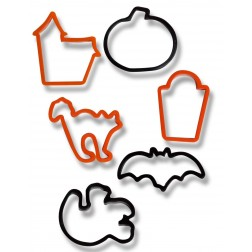
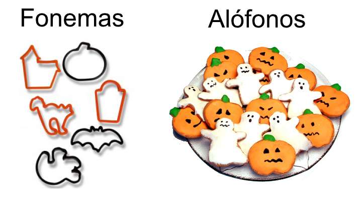
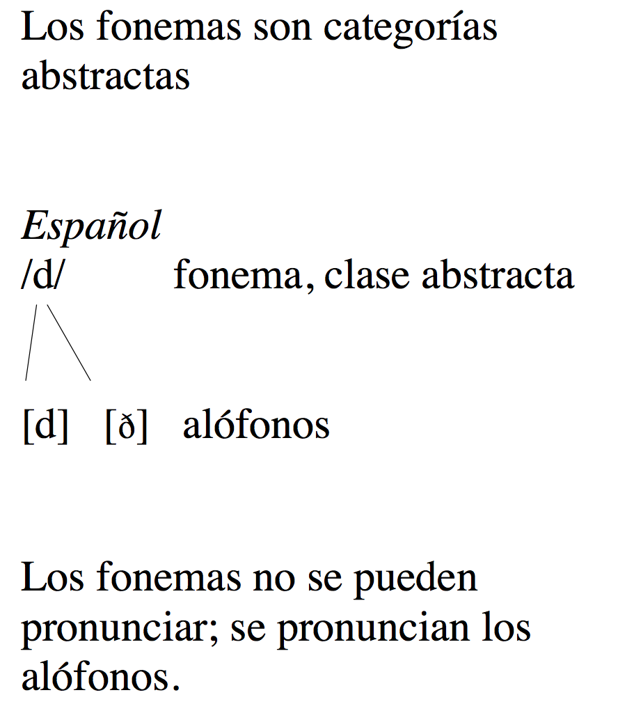

## Unos ejemplos...

- Juan y Ernesto insisten mucho.
- Pedro hizo dos viajes a Indio, California.
- Nadie sabía si Marta tenía cáncer. 
- Este señor es un amigo mío. 

---

## Unos ejemplos...

- Juan y Ernesto insisten mucho.  
jua.nyer.nes.toin.sis.ten.mu.cho
- Pedro hizo dos viajes a Indio, California.  
pe.dro.hi.zo.dos.via.je.sa.in.dio.ca.li.for.nia
- Nadie sabía si Marta tenía cáncer.  
na.die.sa.bí.a.si.mar.ta.te.ní.a.kán.cer
- Este señor es un amigo mío.  
es.te.se.ño.re.su.na.mi.go.mí.o

---

## Unos ejemplos...

- Juan y Ernesto insisten mucho.  
jua.nyer.nes.toin.sis.ten.mu.cho  
/ˈxu̯a.ni̯er.ˈnes.toi̯n.ˈsis.ten.ˈmu.ʧo/
- Pedro hizo dos viajes a Indio, California.  
pe.dro.hi.zo.dos.via.je.sa.in.dio.ca.li.for.nia  
/ˈpe.dro.ˈi.so.ˈdos.ˈbi̯a.xe.sa.ˈin.di̯oːka.li.ˈfor.ni̯a/
- Nadie sabía si Marta tenía cáncer.  
na.die.sa.bí.a.si.mar.ta.te.ní.a.kán.cer  
/ˈna.di̯e.sa.ˈbi.a.si.ˈmar.ta.te.ˈni.a.ˈkan.ser/
- Este señor es un amigo mío.  
es.te.se.ño.re.su.na.mi.go.mí.o  
/ˈes.te.se.ˈɲo.ˈre.su.na.ˈmi.go.ˈmi.o/

<!-- - p. 38 de las notas de clase  -->

--- .segue bg:grey

  

   

# Fonema vs. alófono

---

## Fonema vs. alófono

Los sonidos [d] y [ð] existen en inglés y en español

|     |  Inglés  |                      |  Español   |                   |
| :-- | :------- | :------------------- | :--------- | :---------------- |
|     | **[d]**  | <BLUE>[ð]</BLUE>     | **[d]**    | <BLUE>[ð]</BLUE>  |
|     | **d**ump | lea<BLUE>th</BLUE>er | sal**d**o  | ha<BLUE>d</BLUE>a |
|     | ru**d**e | wea<BLUE>th</BLUE>er | **d**oy    | na<BLUE>d</BLUE>a |
|     | **d**own | wi<BLUE>th</BLUE>er  | cuan**d**o | mi<BLUE>d</BLUE>e |

--- &twocol

## Fonema vs. Alófono

  
  

### Sin embargo, los sonidos [d] y [ð] funcionan de modo diferente en inglés y en español.

         

*** {name: left}

Español

>- [ð]: no me <BLUE>d</BLUE>en (do not give me)
- [d]: pon '**d**en' (write *den*)

*** {name: right}

Inglés

>- [ð]: <BLUE>th</BLUE>en
- [d]: **d**en

---

## Fonema vs. Alófono

  
  

- En **inglés**, establecen diferencias de significado, son **contrastivos**:
	- **th**en [ð]
	- **d**en [d]
- *then* y *den* son cosas diferentes. Hay **dos fonemas**.

---

## Fonema vs. Alófono

  
  

- En **español**, [ð] y [d] son variantes de un 'sonido' básico.
- La palabra 'den' en estas frases es la misma, a pesar de que se pronuncia diferente:
	- no me den [ð] 'do not give me'
	- pon ‘den’ [d] 'write "den"'
- [ð] y [d] son dos variantes (**alófonos**) del **mismo fonema**.

---

## 

 

  

---

## 

 

  

---

## Definamos

  
  

- **Fonema**: La unidad mínima que puede cambiar el significado de una palabra. Es una representación abstracta de uno o más sonidos (estos sonidos se llaman **alófonos**).
	- '**p**eso' /ˈ**p**e.so/
	- '**b**eso' /ˈ**b**e.so/ 

---

## Definamos

  
  

### Las realizaciones de /b/ en "un beso" y "ese beso" son distintas pero no representan dos fonemas porque el significado de la palabra no cambia.

 

- **Alófono**: La realización específica y concreta de un fonema.
	- Un **b**eso [um.ˈ**b**e.so]
	- Ese **b**eso [e.se.ˈ**β**e.so]

--- &twocol

## Repasemos

  

 

*** {name: left}

**Fonema**: 

- representación abstracta y generalizada de un sonido
- se escribe entre //

*** {name: right}

<BLUE>Alófono</BLUE>: 

- cada realización concreta y específica de un fonema
- se escribe entre [ ] 

---

## Pensemos

  
  

> - ¿Cómo sabemos si dos sonidos cambian el significado y por ello pertenecen a dos fonemas diferentes?
> - Si podemos formar un *par mínimo*.
> - Un par mínimo es un par de palabras que sólo se diferencian en la pronunciación en un sonido y esa diferencia establece diferencias de significado.
> - 'Then' y 'den' representan un par mínimo en inglés (/ð/ vs. /d/), pero esos mismos sonidos no son contrastivos en español (sólo hay /d/).
  - /ðen/ y /den/ son palabras distintas en inglés
  - [den] y [ðen] no son palabras distintas en español

---

## Pares mínimos

|     Par mínimo    | Transcripción fonémica | Significado |
| :---------------- | :--------------------- | :---------- |
| **den**           | /ˈden/                 | 'guarida'   |
| **then**          | /ˈðen/                 | 'entonces'  |
| <BLUE>pata</BLUE> | /ˈpa.ta/               | 'leg'       |
| <BLUE>bata</BLUE> | /ˈba.ta/               | 'gown'      |
| **lapa**          | /ˈla.pa/               | 'barnacle'  |
| **lava**          | /ˈla.va/               | 'lava'      |
| <BLUE>toma</BLUE> | /ˈto.ma/               | 'take'      |
| <BLUE>doma</BLUE> | /ˈdo.ma/               | 'taming'    |
| **casa**          | /ˈka.sa/               | 'house'     |
| **gasa**          | /ˈga.sa/               | 'gauze'     |

---

## 

  

---

## ¿Fonema o alófono?

  
  

### Preguntas para determinar si dos sonidos son fonemas diferentes o variantes del mismo fonema:

### Español

>- ¿Establecen diferencias de significado en español [ð] y [d]? **No**.
- ¿Cómo lo sé? ¿Existe algún par mínimo en español entre [ð] y [d]? **No**.
- Por lo tanto, [ð] y [d] en español pertenecen a la misma categoría/clase abstracta.
- [ð] y [d] son alófonos (realizaciones) del mismo fonema, /d/.

---

## ¿Fonema o alófono?

  
  

### Preguntas para determinar si dos sonidos son fonemas diferentes o variantes del mismo fonema:

### Inglés

>- ¿Establecen diferencias de significado en inglés [ð] y [d]? **Sí**. 
- ¿Cómo lo sé? ¿Existen pares mínimos en inglés entre [ð] y [d]? **Sí**. Por ejemplo, 'then' y 'den'.
- Por lo tanto, [ð] y [d] en inglés pertencen a dos categorías/clases abstractas diferentes. Son dos fonemas.
- [ð] y [d] son alófonos (realizaciones) de dos fonemas diferentes: /ð/ y /d/.

---

## Repasemos

>- El fonema es un concepto abstracto.
>- El alófono es la representación de un sonido.
>- Los fonemas no se articulan, pero los alófonos sí.
>- Los fonemas cambian el significado de una palabra. Son contrastivos.
>- Los alófonos no cambian el significado de una palabra. No son contrastivos.
>- Para saber si un sonido es fonema o no hay que intentar establecer un "par mínimo".

---

## Repasemos

>- Todos los fonemas tienen al menos un alófono, pero no al revés.
- Transcripción fonética: \[   ]  (representación exacta de los sonidos).
- Transcripción fonológica: /   / (representación abstracta).
- Lo que es un fonema en un idioma, puede ser un alófono en otro.

---

## A practicar

- ¿Cuántos alófonos tiene el fonema /t/ en inglés?
- ¿Cuáles son algunos de los factores que influyen en cómo pronunciamos (alófonos) los sonidos de nuestra fonología nativa (fonemas)?
- Dad un ejemplo de un par mínimo. Explicad cómo sabéis que es un par mínimo. Fundamentad vuestro ejemplo con datos.

---

## A practicar

>- ¿Cuántos alófonos tiene el fonema /t/ en inglés?
  - [t]: 's**t**orm'
  - [t^h^]: '**t**alk'
  - [ɾ]: 'wa**t**er'
>- ¿Cuáles son algunos de los factores que influyen en cómo pronunciamos (alófonos) los sonidos de nuestra fonología nativa (fonemas)?
  - El contxto fonético
  - El dialecto de la persona
  - Otras cosas: estado de animo, énfasis, cansancio, velocidad, etc.
- Dad un ejemplo de un par mínimo. Explicad cómo sabéis que es un par mínimo. Fundamentad vuestro ejemplo con datos.

--- .segue bg:grey

# Pruebita

---

## Pruebita

- hi

