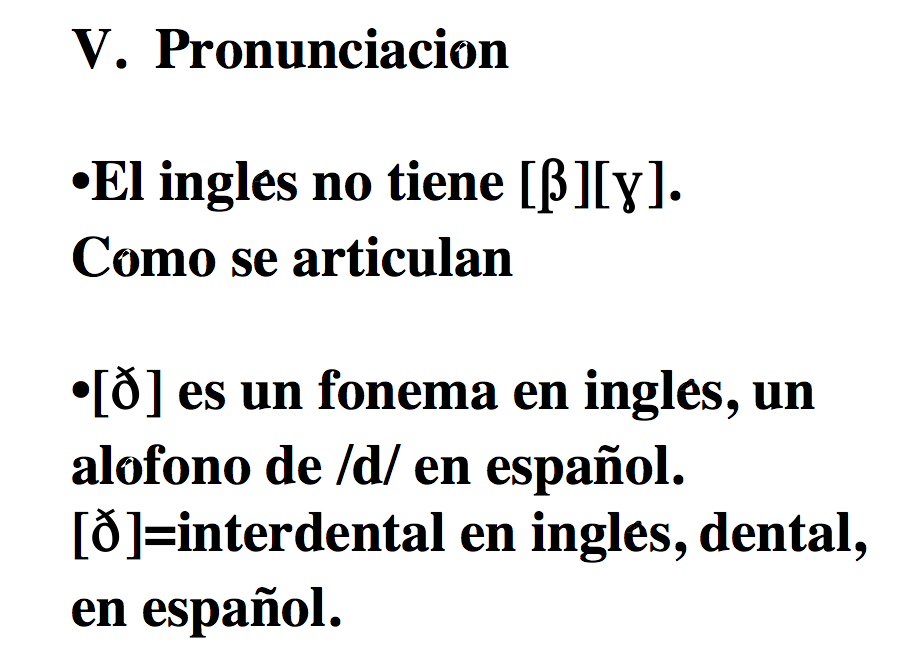
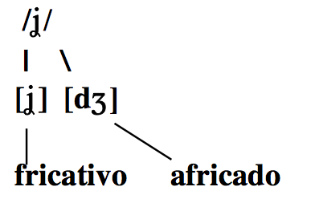
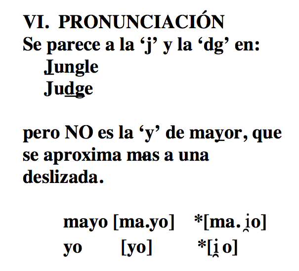

## En grupos...

  
  

>- Definid **fonema** y aportad un ejemplo.
- Definid **alófono** y aportad un ejemplo.
- ¿Cómo sabemos si dos sonidos son fonemas o alófonos? ¿Qué prueba podemos usar?
- ¿Cuáles son las diferencias entre las oclusivas sordas del inglés con respecto a las del español?

--- .segue bg:grey

# Práctica 

---

## A transcribir

1. No me digas ahora eso porque no lo entiendo
1. Los dos hermanos salieron a pasear al parque
1. Cuando Inés vino a cenar, le regalé dos flores
1. La pared azul antes era blanca
1. No te pongas esos pantalones porque están húmedos
1. Justino, Antonio y Juan no son mis novios
1. No voy al concierto contigo
1. Los triptongos me asustan mucho de vez en cuando
1. No contestes el teléfono si es para mí
1. Al final sí encontré lo que me dijiste
1. La cámara de gas no fue un buen invento de la humanidad

---

## A transcribir

1. Nomedigasahoraesoporquenoloentiendo
1. Losdoshermanossalieronapasearalparque
1. CuandoInésvinoacenar leregalédosflores
1. Laparedazulanteserablanca
1. Notepongasesospantalonesporqueestánhúmedos
1. Justino, AntonioyJuannosonmisnovios
1. Novoyalconciertocontigo
1. Lostriptongosmeasustanmuchodevezencuando
1. Nocontesteselteléfonosiesparamí
1. Alfinalsíencontréloquemedijiste
1. Lacámaradegasnofueunbueninventodelahumanidad

---

## Transcripción fonémica

1. /no.me.ˈdi.ga.sa.ˈo.ɾa.e.so.poɾ.ke.no.lo.en.ˈti̯en.do/
2. /los.do.seɾ.ˈma.no.sa.li̯e.ˈɾo.na.pa.se.ˈa.ɾal.ˈpaɾ.ke/
3. /ku̯an.doi̯.ˈnes.ˈbi.no.a.θe.ˈnaɾ.le.re.ga.ˈle.dos.ˈflo.ɾes/
4. /la.pa.ˈɾe.da.ˈθu.lan.te.ˈse.ɾa.ˈblan.ka/

---

## Transcribid las siguientes oraciones

- Juan y Ernesto fueron de viaje.
- Marta hizo la tarea. 

---

## Juntamos todo...

- JuanyErnestofuerondeviaje.
- Martahizolatarea.

---

## Cuidado con las deslizadas

- /ˈxu̯a.ni̯er.ˈnes.to.ˈfu̯e.ron.de.ˈbi̯a.xe/

---

## ...y los antidiptongos

- /ˈmaɾ.ta.ˈi.θo.la.ta.ˈɾe.a/

---

## Los triptongos

- **Triptongo**: Cualquier combinación monosilábica que empieza con una deslizada, tiene por núcleo una vocal media o baja y termina con otra deslizada. 

 

  deslizada → vocal → deslizada

---

## Los triptongos

### Se dan entre palabras...

|     |       Secuencia        | Transcripción fonológica |
| :-- | :--------------------- | :----------------------- |
|     | ciencia humana:        |                          |
|     | anuncio irresponsable: |                          |
|     | fue imposible:         |                          |
|     | antiguo irlandés:      |                          |

---

## Los triptongos

### Se dan entre palabras...

|     |       Secuencia        |     Transcripción fonológica    |
| :-- | :--------------------- | :------------------------------ |
|     | ciencia humana:        | /ˈθi̯en.θi̯au̯.ˈma.na/          |
|     | anuncio irresponsable: | /a.ˈnun.θi̯oi̯.res.pon.ˈsa.ble/ |
|     | fue imposible:         | /ˈfu̯ei̯m.po.ˈsi.ble/           |
|     | antiguo irlandés:      | /an.ˈti.gu̯oi̯ɾ.lan.ˈdes/       |

---

## Los triptongos

### ...y también en la forma vosotros.
  
>- cambiáis: /kam.ˈbi̯ai̯s/
- continuáis: /kon.ti.ˈnu̯ai̯s/

--- .segue bg:grey

# Las obstruyentes sonoras

---

## Los fonemas oclusivos sonoros: /b, d, g/

 

>- /b/: **bilabial**, oclusivo, sonoro
>- /d/: **dental**, oclusivo, sonoro
>- /g/: **velar**, oclusivo, sonoro

<!-- 

  

 -->

<!-- \includegraphics[scale=.25]{bdg1.png} -->

---

## Los fonemas oclusivos sonoros: /b, d, g/

### Son fonemas, hay pares mínimos

 

| Principio de palabra |                           |     | Interior de palabra |                           |
| :------------------- | :------------------------ | :-- | :------------------ | :------------------------ |
| **b**ala/**m**ala    | /ˈ**b**a.la/ /ˈ**m**a.la/ |     | be**b**a/be**s**a   | /ˈbe.**b**a/ /ˈbe.**s**a/ |
| **d**ato/**g**ato    | /ˈ**d**a.to/ /ˈ**g**a.to/ |     | se**d**a/se**c**a   | /ˈse.**d**a/ /ˈse.**k**a/ |
| **g**ato/**p**ato    | /ˈ**g**a.to/ /ˈ**p**a.to/ |     | me**g**a/me**s**a   | /ˈme.**g**a/ /ˈme.**s**a/ |

<!-- 

  

 -->

<!-- \includegraphics[scale=.25]{bdg2.png} -->

---

## Los fonemas oclusivos sonoros: /b, d, g/

### Cada fonema tiene dos alófonos...

 

  

<!-- \includegraphics[scale=.25]{bdg3.png} -->

---

## Los fonemas oclusivos sonoros: /b, d, g/

### En inglés las oclusivas sonoras sólo tienen un alófono (oclusivo)

 

  

<!-- \includegraphics[scale=.25]{bdg4.png} -->

---

## Los fonemas oclusivos sonoros: /b, d, g/

### La pronunciación

- El inglés no tiene [β] ni [ɣ]
- [ð] es un fonema en inglés, pero es un alófono de /d/ en español
- [ð] es interdental en inglés, pero dental en español

<!-- 

  

 -->

---

## ¿Cómo se articulan?

<iframe width="560" height="315" src="http://soundsofspeech.uiowa.edu/spanish/spanish.html" frameborder="0" allowfullscreen></iframe>

---

## Los fonemas oclusivos sonoros: /b, d, g/

- El español no tiene como fonema el sonido labiodental [v]
- Los grafemas 'b' y 'v' siempre son bilabiales

 

|  Lengua | Palabra  | Transcripción fonética |
| :------ | :------- | :--------------------- |
| inglés  | 'visit'  | [ˈ**v**i.zit]          |
| español | 'visita' | [**b**i.ˈsi.ta]        |

<!-- 

  

 -->

<!-- \includegraphics[scale=.25]{bdg6.png} -->

---

## Los fonemas oclusivos sonoros: /b, d, g/

### El fonema /b/:

1. [b]: modo oclusivo
  - [ˈam.bos]
  - [ˈbe.to]
2. [β]: modo fricativo
  - [ˈu.βo]
  - [ˈal.βa]

  

### ¿En qué contextos se encuentran?

>- [b] → después de una nasal o una pausa
- [β] → en el resto de los contextos e incluso entre palabras

---

## Distribución complementaria

  

---

## Distribución complementaria

  
  

- Es una situación lingüística en la cual un sonido "A" aparece en determinados contextos y "B" aparece en el resto de los contextos en los cuales "A" no aparece.

---

  
## Las oclusivas sonoras /b/, /d/ y /g/

### El fonema /d/:

1. [d]: modo oclusivo
  - [ˈan.do]
  - [al.ˈde.a]
2. [ð]: modo fricativo
  - [ˈla.ðo]

### El fonema /g/:

1. [g]: modo oclusivo
  - [ˈtaŋ.go]
2. [ɣ]: modo fricativo
  - [ˈma.ɣo]

---

  

<!-- \includegraphics[scale=.25]{b.pdf} -->

---

  

<!-- \includegraphics[scale=.25]{g.pdf} -->

---

  

<!-- \includegraphics[scale=.25]{d.pdf} -->

---

  

<!-- \includegraphics[scale=.25]{d2.pdf} -->

---

## Distribución complementaria

|     |           |     |                                                                     |
| :-: | :-------- | :-: | :------------------------------------------------------------------ |
|  -  | [b, d, g] |  →  | Después de una nasal o una pausa; después de [l] en el caso de [d]. |
|     |           |     |                                                                     |
|     |           |     |                                                                     |

---

## Distribución complementaria

|     |           |     |                                                                     |
| :-: | :-------- | :-: | :------------------------------------------------------------------ |
|  -  | [b, d, g] |  →  | Después de una nasal o una pausa; después de [l] en el caso de [d]. |
|     |           |     |                                                                     |
|  -  | [β, ð, ɣ] |  →  | En el resto de los contextos e incluso entre palabras               |

---

    
## Distribución complementaria

### \*Esta regla se aplica incluso entre palabras, dentro de un mismo grupo fónico, como en:

|             |                    |
| :---------- | :----------------- |
| En Guadiana | [eŋ.gu̯a.ˈði̯a.na] |
| A Guadiana  | [a.ɣu̯a.ði̯a.na]   |

---

## Distribución complementaria
      
### \*Esta regla se aplica incluso entre palabras, dentro de un mismo grupo fónico, como en:

|          |                |
| :------- | :------------- |
| El dueño | [el.ˈdu̯e.ɲo]  |
| A Damián | [a.ða.ˈmi̯an] |

---

## La fricativización

### /b, d, g/ → [β, ð, ɣ]

>- Este proceso ocurre cuando los sonidos oclusivos sonoros (en español /b, d, g/) se pronuncian con fricción.  Este proceso convierte los oclusivos en fricativos [β, ð, ɣ]
- Supone un cambio de modo
- El sonido afectado aparece en posición inicial de sílaba 
- El único proceso en el cual el sonido que aparece *anteriormente* dicta el cambio del sonido

---

## Transcribid

1. No me digas ahora eso porque no lo entiendo
1. Los dos hermanos salieron a pasear al parque
1. Cuando Inés vino a cenar, le regalé dos flores
1. La pared azul antes era blanca

---

## Transcripción fonémica

1. /no.me.ˈ**d**i.**g**a.sa.ˈo.ɾa.e.so.poɾ.ke.no.lo.en.ˈti̯en.**d**o/
2. /los.**d**o.seɾ.ˈma.no.sa.li̯e.ˈɾo.na.pa.se.ˈa.ɾal.ˈpaɾ.ke/
3. /ku̯an.**d**oi̯.ˈnes.ˈ**b**i.no.a.θe.ˈnaɾ.le.re.**g**a.ˈle.**d**os.ˈflo.ɾes/
4. /la.pa.ˈɾe.**d**a.ˈθu.lan.te.ˈse.ɾa.ˈ**b**lan.ka/

---

## Transcripción fonética

1. /no.me.ˈdi.ga.sa.ˈo.ɾa.e.so.poɾ.ke.no.lo.en.ˈti̯en.do/  
   [no.me.ˈ**ð**i.**ɣ**a.sa.ˈo.ɾa.e.so.poɾ.ke.no.lo.en̪.ˈti̯en̪.**d**o]
2. /los.do.seɾ.ˈma.no.sa.li̯e.ˈɾo.na.pa.se.ˈa.ɾal.ˈpaɾ.ke/  
   [loz.**ð**o.seɾ.ˈma.no.sa.li̯e.ˈɾo.na.pa.se.ˈa.ɾal.ˈpaɾ.ke]
3. /ku̯an.doi̯.ˈnes.ˈbi.no.a.θe.ˈnaɾ.le.re.ga.ˈle.dos.ˈflo.ɾes/  
   [ku̯an̪.**d**oi̯.ˈnez.ˈ**β**i.no.a.θe.ˈnaɾ.le.re.**ɣ**a.ˈle.**ð**os.ˈflo.ɾes]
4. /la.pa.ˈɾe.da.ˈθu.lan.te.ˈse.ɾa.ˈblan.ka/  
   [la.pa.ˈɾe.**ð**a.ˈθu.lan̪.te.ˈse.ɾa.ˈ**β**laŋ.ka]

--- .segue bg:grey

# Práctica

---

### Fito y fitipaldis "Soldadito marinero"

<iframe width="420" height="315" src="https://www.youtube.com/embed/RGimnBDtNQI" frameborder="0" allowfullscreen></iframe>

---

## Fito y fitipaldis "Soldadito marinero"

Él camina **d**espacito que las prisas no son **b**uenas,  
en su **b**razo **d**o**b**la**d**ita con cui**d**a**d**o la chaqueta.  
Lue**g**o pasa por la calle **d**on**d**e los cha**v**ales jue**g**an,  
él tam**b**ién quiso ser niño pero le pilló la **g**uerra.  

Sol**d**a**d**ito marinero conociste a una sirena  
**d**e esas que **d**icen te quiero si **v**en la cartera llena.  
Esco**g**iste a la mas **g**uapa y a la menos **b**uena,  
sin sa**b**er como ha **v**eni**d**o te ha co**g**i**d**o la tormenta  

---

## Fito y fitipaldis "Soldadito marinero"

Él camina **ð**espacito que las prisas no son **β**uenas,  
en su **β**razo **ð**o**β**la**ð**ita con cui**ð**a**ð**o la chaqueta.  
Lue**ɣ**o pasa por la calle **ð**on**d**e los cha**β**ales jue**ɣ**an,  
él tam**b**ién quiso ser niño pero le pilló la **ɣ**uerra.  

Sol**d**a**ð**ito marinero conociste a una sirena  
**d**e esas que **ð**icen te quiero si **β**en la cartera llena.  
Esco**x**iste a la mas **ɣ**uapa y a la menos **β**uena,  
sin sa**β**er como ha **β**eni**ð**o te ha co**x**i**ð**o la tormenta  

---

## Fito y fitipaldis "Soldadito marinero"

Él quería cruzar los mares y ol**v**i**d**ar a su sirena,  
la **v**er**d**a**d** no fue **d**ificil cuan**d**o conoció a Mariela,  
que tenia los ojos **v**er**d**es y el ne**g**ocio entre las piernas.  
¡Hay que **v**er que puntería no te arrimas a una **b**uena!  

Sol**d**a**d**ito marinero conociste a una sirena  
**d**e esas que **d**icen te quiero si **v**en la cartera llena  
Esco**g**iste a las mas **g**uapa y a la menos **b**uena,  
sin sa**b**er como ha **v**eni**d**o te ha co**g**i**d**o la tormenta.  

**D**espués **d**e un in**v**ierno malo, una mala prima**v**era,  
**d**ime porqué estas **b**uscan**d**o una lá**g**rima en la arena.  

---

## Fito y fitipaldis "Soldadito marinero"

Él quería cruzar los mares y ol**β**i**ð**ar a su sirena,  
la **β**er**ð**a**ð** no fue **ð**ificil cuan**d**o conoció a Mariela,  
que tenia los ojos **β**er**ð**es y el ne**ɣ**ocio entre las piernas.  
¡Hay que **β**er que puntería no te arrimas a una **β**uena!  

Sol**d**a**ð**ito marinero conociste a una sirena  
**d**e esas que **ð**icen te quiero si **β**en la cartera llena  
Esco**x**iste a las mas **ɣ**uapa y a la menos **β**uena,  
sin sa**β**er como ha **β**eni**ð**o te ha co**x**i**ð**o la tormenta.  

**D**espués **ð**e un in**b**ierno malo, una mala prima**β**era,  
**d**ime por qué estas **β**uscan**d**o una lá**ɣ**rima en la arena.  

---

## Transcribid

- Juan fue inmediatamente a la tienda a comprar pan.

---

## Transcrición fonémica

- /ˈxu̯an.ˈfu̯ei̯n.me.di̯a.ta.men.te.a.la.ˈti̯en.daː.kom.pɾaɾ.pan/

---

## Describid

|     |       Modo       |      Punto       |    Sonoridad     |
| :-- | :--------------- | :--------------- | :--------------- |
| [b] | \_\_\_\_\_\_\_\_ | \_\_\_\_\_\_\_\_ | \_\_\_\_\_\_\_\_ |
| [g] | \_\_\_\_\_\_\_\_ | \_\_\_\_\_\_\_\_ | \_\_\_\_\_\_\_\_ |
| [ɣ] | \_\_\_\_\_\_\_\_ | \_\_\_\_\_\_\_\_ | \_\_\_\_\_\_\_\_ |
| [d] | \_\_\_\_\_\_\_\_ | \_\_\_\_\_\_\_\_ | \_\_\_\_\_\_\_\_ |
| [ð] | \_\_\_\_\_\_\_\_ | \_\_\_\_\_\_\_\_ | \_\_\_\_\_\_\_\_ |
| [f] | \_\_\_\_\_\_\_\_ | \_\_\_\_\_\_\_\_ | \_\_\_\_\_\_\_\_ |
| [x] | \_\_\_\_\_\_\_\_ | \_\_\_\_\_\_\_\_ | \_\_\_\_\_\_\_\_ |
| [β] | \_\_\_\_\_\_\_\_ | \_\_\_\_\_\_\_\_ | \_\_\_\_\_\_\_\_ |

---

## Describid

|     |    Modo   |    Punto    | Sonoridad |
| :-- | :-------- | :---------- | :-------- |
| [b] | oclusivo  | bilabial    | sonoro    |
| [g] | oclusivo  | velar       | sonoro    |
| [ɣ] | fricativo | velar       | sonoro    |
| [d] | oclusivo  | dental      | sonoro    |
| [ð] | fricativo | dental      | sonoro    |
| [f] | fricativo | labiodental | sordo     |
| [x] | fricativo | velar       | sordo     |
| [β] | fricativo | bilabial    | sonoro    |

--- .segue bg:grey

  

 

# La yod(a) [ˈdʒo.ða]

---

## La yod

  

- /ʝ/: fricativa, palatal, sonora

<!-- 

  

 -->

<!-- \includegraphics[scale=.4]{yod1.png} -->

---

## La yod

  

### Es un fonema, hay pares mínimos

      

| Principio de palabra |                           |     | Interior de palabra |                           |
| :------------------- | :------------------------ | :-- | :------------------ | :------------------------ |
| **ll**oro/**l**oro   | /ˈ**ʝ**o.ro/ /ˈ**l**o.ɾo/ |     | be**ll**a/be**s**a  | /ˈbe.**ʝ**a/ /ˈbe.**s**a/ |

<!-- 

  

 -->

<!-- \includegraphics[scale=.4]{yod2.png} -->

---

## La yod

### Tiene dos alófonos

  

<!-- \includegraphics[scale=.4]{yod3.png} -->

---

## La yod

### Distribución de alófonos

- Africado después de nasal o pausa
- Fricativo en el resto de los contextos

 

  

<!-- \includegraphics[scale=.4]{yod4.png} -->

---

## La yod

### Distribución de alófonos

- Africado después de nasal o pausa
- Fricativo en el resto de los contextos

 

  

>- Las mismas reglas se aplican entre palabras
  - el yunque: [el.ˈʝuŋ.ke]
  - un yunque: [un.ˈdʒuŋ.ke]

<!-- \includegraphics[scale=.4]{yod5.png} -->

---

## La yod

### Ortografía

| Fonema | Grafemas |   Ejemplos   |
| :----- | :------- | :----------- |
| /ʝ/    | 'll'     | '**ll**anto' |
|        | 'y'      | '**y**o'     |
|        | 'hi-'    | '**hi**erba' |

<!-- 

  

 -->

<!-- \includegraphics[scale=.4]{yod6.png} -->

---

## La yod

### Pronunciación

>- [ʝ]
  - Más fuerte que 'y' en inglés en
    - '**y**ellow'
- [dʒ]
  - Parecido a la pronunciación de 'j' y 'dg' en inglés en 
    - '**j**ungle'
    - 'ju**dg**e'

<!-- 

  

 -->
<!-- \includegraphics[scale=.4]{yod7.png} -->

---

## La yod

<iframe width="560" height="315" src="http://soundsofspeech.uiowa.edu/english/english.html" frameborder="0" allowfullscreen></iframe>

---

## La yod

<iframe width="560" height="315" src="http://soundsofspeech.uiowa.edu/spanish/spanish.html" frameborder="0" allowfullscreen></iframe>

--- .segue bg:grey

# Práctica

---

## Práctica

- Voy a ir a la tienda hindú del barrio italiano a comprar unos zapatos.
- A Juana la eligieron reina del concurso de belleza internacional.
- Juan Andrés es dueño de una huerta grande en la ciudad de Medellín.

---

## Práctica

- Voyairalatiendahindúdelbarrioitalianoacomprarunoszapatos.
- AJuanalaeligieronreinadelconcursodebellezainternacional.
- JuanAndrésesdueñodeunahuertagrandeenlaciudaddeMedellín.

---

## Práctica

- /**b**oi̯.a.ˈi.ɾa.la.ˈti̯eN.**d**ai̯N.ˈ**d**u.**d**el.ˈ**b**a.ri̯oi̯.ta.ˈli̯a.no.a.koN.ˈpɾa.ɾu.nos.θa.ˈpa.tos/
- /a.ˈxu̯a.na.la.e.li.ˈxi̯e.ɾoN.ˈrei̯.na.**d**el.koN.ˈkúɾ.so.**d**e.**b**e.ˈʝe.θai̯N.teɾ.na.θi̯o.ˈnal/
- /ˈxu̯a.naN.ˈ**d**ɾe.ˈses.ˈ**d**u̯e.ɲo.**d**eu̯.na.ˈwéɾ.ta.**g**raN.**d**eːN.la.θi̯u.ˈ**d**a.**d**e.me.**d**e.ˈʝiN/

---

## Práctica

- /**b**oi̯.a.ˈi.ɾa.la.ˈti̯eN.**d**ai̯N.ˈ**d**u.**d**el.ˈ**b**a.ri̯oi̯.ta.ˈli̯a.no.a.koN.ˈpɾa.ɾu.nos.θa.ˈpa.tos/  
  [**b**oi̯.a.ˈi.ɾa.la.ˈti̯en̪.**d**ai̯n̪.ˈ**d**u.**ð**el.ˈ**β**a.ri̯oi̯.ta.ˈli̯a.no.a.kom.ˈpɾa.ɾu.nos.θa.ˈpa.tos]
- /a.ˈxu̯a.na.la.e.li.ˈxi̯e.ɾoN.ˈrei̯.na.**d**el.koN.ˈkúɾ.so.**d**e.**b**e.ˈʝe.θai̯N.teɾ.na.θi̯o.ˈnal/  
  [a.ˈxu̯a.na.la.e.li.ˈxi̯e.ɾon.ˈrei̯.na.**ð**el.koŋ.ˈkuɾ.so.**ð**e.**β**e.ˈʝe.θai̯n̪.ter.na.θi̯o.ˈnal]
- /ˈxu̯a.naN.ˈ**d**ɾe.ˈses.ˈ**d**u̯e.ɲo.**d**eu̯.na.ˈwéɾ.ta.**g**raN.**d**eːN.la.θi̯u.ˈ**d**a.**d**e.me.**d**e.ˈʝiN/  
  [ˈxu̯a.nan̪.ˈ**d**re.ˈsez.ˈ**ð**u̯e.ɲo.**ð**eu̯.na.ˈweɾ.ta.**ɣ**ɾan̪.**d**eːn.la.θi̯u.ˈ**ð**a.**ð**e.me.**ð**e.ˈjin]

---

