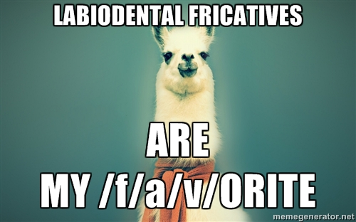
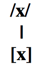
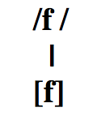
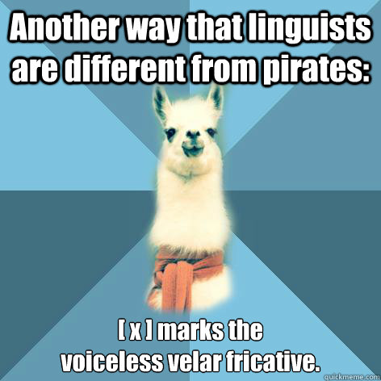
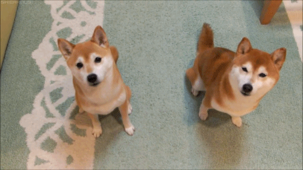
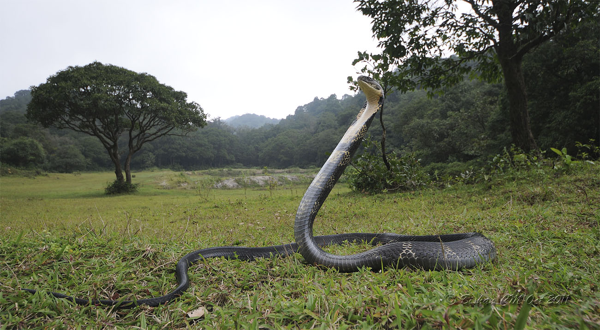
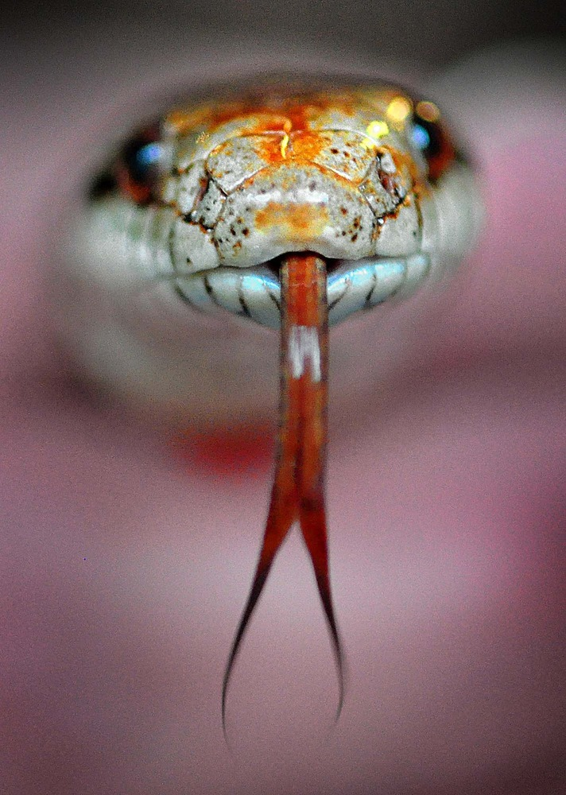
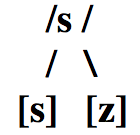
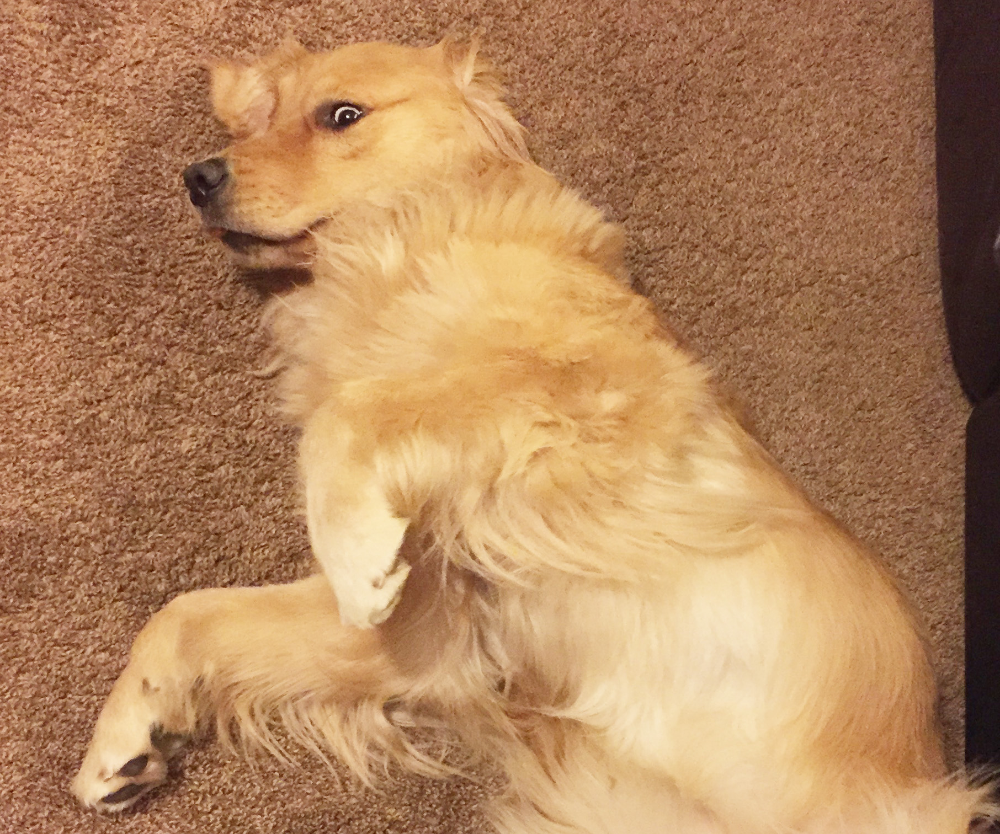

## En grupos...

  
  

### ¿Qué sabéis de las siguientes clases de sonidos?

- Las oclusivas sordas
- Las oclusivas sonoras

### Comentad... 

- los fonemas/alófonos relevantes
- los procesos fonológicos relevantes
- las diferencias entre el inglés y el español
- los retos que presentan para el no nativo

### El efecto 'McGurk'

- ¿Qué es?
- ¿Qué nos enseña acerca de la percepción del habla?

---

## El efecto 'McGurk'

<iframe width="560" height="315" src="https://www.youtube.com/embed/FefFfvriAwQ" frameborder="0" allowfullscreen></iframe>

---

## El efecto 'McGurk'

<iframe width="560" height="315" src="https://www.youtube.com/embed/PWGeUztTkRA" frameborder="0" allowfullscreen></iframe>

--- .segue bg:grey

# Práctica 

---

## A transcribir

1. No me digas ahora eso porque no lo entiendo
1. Los dos hermanos salieron a pasear al parque
1. Cuando Inés vino a cenar, le regalé dos flores
1. La pared azul antes era blanca
1. **No te pongas esos pantalones porque están húmedos**
1. **Justino, Antonio y Juan no son mis novios**
1. No voy al concierto contigo
1. Los triptongos me asustan mucho de vez en cuando
1. No contestes el teléfono si es para mí
1. Al final sí encontré lo que me dijiste
1. La cámara de gas no fue un buen invento de la humanidad

---

## A transcribir

1. Nomedigasahoraesoporquenoloentiendo
1. Losdoshermanossalieronapasearalparque
1. CuandoInésvinoacenar leregalédosflores
1. Laparedazulanteserablanca
1. Notepongasesospantalonesporqueestánhúmedos
1. Justino, AntonioyJuannosonmisnovios
1. Novoyalconciertocontigo
1. Lostriptongosmeasustanmuchodevezencuando
1. Nocontesteselteléfonosiesparamí
1. Alfinalsíencontréloquemedijiste
1. Lacámaradegasnofueunbueninventodelahumanidad

---

## Transcripción

1. /no.me.ˈdi.ga.sa.ˈo.ɾa.e.so.poɾ.ke.no.lo.en.ˈti̯en.do/  
   [no.me.ˈ**ð**i.**ɣ**a.sa.ˈo.ɾa.e.so.poɾ.ke.no.lo.en̪.ˈti̯en̪.**d**o]
2. /los.do.seɾ.ˈma.no.sa.li̯e.ˈɾo.na.pa.se.ˈa.ɾal.ˈpaɾ.ke/  
   [loz.**ð**o.seɾ.ˈma.no.sa.li̯e.ˈɾo.na.pa.se.ˈa.ɾal.ˈpaɾ.ke]
3. /ku̯an.doi̯.ˈnes.ˈbi.no.a.θe.ˈnaɾ.le.re.ga.ˈle.dos.ˈflo.ɾes/  
   [ku̯an̪.**d**oi̯.ˈnez.ˈ**β**i.no.a.θe.ˈnaɾ.le.re.**ɣ**a.ˈle.**ð**os.ˈflo.ɾes]
4. /la.pa.ˈɾe.da.ˈθu.lan.te.ˈse.ɾa.ˈblan.ka/  
   [la.pa.ˈɾe.**ð**a.ˈθu.lan̪.te.ˈse.ɾa.ˈ**β**laŋ.ka]
5. /no.te.ˈpon.ga.se.sos.pan.ta.ˈlo.nes.poɾ.ke:s.ˈta.ˈnu.me.dos/  
   [no.te.ˈpoŋ.**g**a.se.sos.pan̪.ta.ˈlo.nes.poɾ.ke:s.ˈta.ˈnu.me.**ð**os]
6. /xus.ˈti.no‖an.ˈto.ni̯oi̯.ˈxu̯a.no.son.mis.ˈno.bi̯os/  
   [xus.ˈti.no‖an̪.ˈto.ni̯oi̯.ˈxu̯a.no.som.mis.ˈno.**β**i̯os]

--- .segue bg:grey

# Las fricativas /f, x/

--- .segue bg:black

  

# /f/

---

## El fonema /f/

  

- /f/: fricativa, labiodental, sorda

---

## El fonema /f/

### Es un fonema, hay pares mínimos

 

|  Principio de palabra |                                 |     |  Interior de palabra  |                                   |
| :-------------------- | :------------------------------ | :-- | :-------------------- | :-------------------------------- |
| **f**uente/**p**uente | /ˈ**f**u̯en.te/ /ˈ**p**u̯en.te/ |     | a**f**eite/a**c**eite | /a.ˈ**f**ei̯.te/ /a.ˈ**θ**ei̯.te/ |

<!-- 

  

 -->

---

## El fonema /f/

### Sólo tiene 1 alófono

  

---

## El fonema /f/

### Ortografía

- Correspondencia exclusiva
    - 'f' = /f/ siempre

### Pronunciación

- Igual que en inglés
- No presenta ningún problema para el no nativo

--- .segue bg:black

  

# /x/

---

## El fonema /x/

  

- /x/: fricativa, velar, sorda

---

## El fonema /x/

### Es un fonema, hay pares mínimos

 

|  Principio de palabra |                           |     |  Interior de palabra  |                             |
| :-------------------- | :------------------------ | :-- | :-------------------- | :-------------------------- |
| **j**uez/**n**uez     | /ˈ**x**u̯eθ/ /ˈ**n**u̯eθ/ |     | ba**j**ar/ba**ñ**ar   | /ba.ˈ**x**aɾ/ /ba.ˈ**ɲ**aɾ/ |

---

## El fonema /x/

### Sólo tiene 1 alófono

  

### Sin embargo, hay variación dialectal

- Se pronuncia con variados grados de fricción
  - Muy débil en latinoamérica: [h] como en 'hat'
  - Más fuerte en la península: [x^h ] o [χ] 

---

## El fonema /x/

<iframe width="560" height="315" src="http://soundsofspeech.uiowa.edu/spanish/spanish.html" frameborder="0" allowfullscreen></iframe>

---

## El fonema /x/

### Problemas para el no nativo

- Casi ninguno
- La pronunciación [h] es común en muchas variedades del español
- Hay más problemas ortográficos

---

## El fonema /x/

### Ortografía

### Ante 'a', 'o', 'u' = 'j'

- pijama
- jota
- jugo

### Ante 'e', 'i' = 'j' o 'g'

- jefe - general
- jinete - gitano

--- .segue bg:grey

# Práctica

---

## A transcribir

1. No me digas ahora eso porque no lo entiendo
1. Los dos hermanos salieron a pasear al parque
1. Cuando Inés vino a cenar, le regalé dos flores
1. La pared azul antes era blanca
1. No te pongas esos pantalones porque están húmedos
1. Justino, Antonio y Juan no son mis novios
1. **No voy al concierto contigo**
1. **Los triptongos me asustan mucho de vez en cuando**
1. No contestes el teléfono si es para mí
1. Al final sí encontré lo que me dijiste
1. La cámara de gas no fue un buen invento de la humanidad

---

1. /no.me.ˈdi.ga.sa.ˈo.ɾa.e.so.poɾ.ke.no.lo.en.ˈti̯en.do/  
   [no.me.ˈ**ð**i.**ɣ**a.sa.ˈo.ɾa.e.so.poɾ.ke.no.lo.en̪.ˈti̯en̪.**d**o]
2. /los.do.seɾ.ˈma.no.sa.li̯e.ˈɾo.na.pa.se.ˈa.ɾal.ˈpaɾ.ke/  
   [loz.**ð**o.seɾ.ˈma.no.sa.li̯e.ˈɾo.na.pa.se.ˈa.ɾal.ˈpaɾ.ke]
3. /ku̯an.doi̯.ˈnes.ˈbi.no.a.θe.ˈnaɾ.le.re.ga.ˈle.dos.ˈflo.ɾes/  
   [ku̯an̪.**d**oi̯.ˈnez.ˈ**β**i.no.a.θe.ˈnaɾ.le.re.**ɣ**a.ˈle.**ð**os.ˈflo.ɾes]
4. /la.pa.ˈɾe.da.ˈθu.lan.te.ˈse.ɾa.ˈblan.ka/  
   [la.pa.ˈɾe.**ð**a.ˈθu.lan̪.te.ˈse.ɾa.ˈ**β**laŋ.ka]
5. /no.te.ˈpon.ga.se.sos.pan.ta.ˈlo.nes.poɾ.ke:s.ˈta.ˈnu.me.dos/  
   [no.te.ˈpoŋ.**g**a.se.sos.pan̪.ta.ˈlo.nes.poɾ.ke:s.ˈta.ˈnu.me.**ð**os]
6. /xus.ˈti.no.an.ˈto.ni̯oi̯.ˈxu̯a.no.son.mis.ˈno.bi̯os/  
   [xus.ˈti.no‖an̪.ˈto.ni̯oi̯.ˈxu̯a.no.som.mis.ˈno.**β**i̯os]
7. /no.boi̯.al.kon.ˈθi̯eɾ.to.kon.ˈti.go/  
   [no.**β**oi̯.al.kon̟.ˈθi̯eɾ.to.kon̪.ˈti.**ɣ**o]
8. /los.tɾip.ˈton.gos.me.a.ˈsus.tan.ˈmu.ʧo.de.be.θen.ku̯an.do/  
   [los.tɾip.ˈtoŋ.**g**oz.me.a.ˈsus.tam.ˈmu.ʧo.**ð**e.**β**e.θeŋ.ku̯an.**d**o]

--- .segue bg:grey

# Repaso

---

## En grupos...

  
  

### Explícale a tu compañer@ los problemas a los que se enfrentan los angloparlantes con respecto a...

- las oclusivas sonoras del español (producción y percepción)
- la fricativa labiodental sorda
- la fricativa velar sorda (ortografía)

### ¿Cómo transcribirías esta frase para una variedad latinoaméricana? ¿y para una variedad peninsular?

- Tu hija quiere comprar zapatos nuevos.

---

## En grupos...

  
  

### Explícale a tu compañer@ los problemas a los que se enfrentan los angloparlantes con respecto a...

- las oclusivas sonoras del español (producción y percepción)
- la fricativa labiodental sorda
- la fricativa velar sorda (ortografía)

### ¿Cómo transcribirías esta frase para una variedad latinoaméricana? ¿y para una variedad peninsular?

- Tu hija quiere comprar zapatos nuevos.  
  **/tu̯i.ha.ˈki̯e.ɾe.kom.ˈpɾaɾ.sa.ˈpa.tos.ˈnu̯e.bos/**  
  **[tu̯i.ha.ˈki̯e.ɾe.kom.ˈpɾaɾ.sa.ˈpa.toz.ˈnu̯e.βos]**  
  <BLUE>/tu̯i.χa.ˈki̯e.ɾe.kom.ˈpɾaɾ.θa.ˈpa.tos.ˈnu̯e.bos/**</BLUE>  
  <BLUE>[tu̯i.χa.ˈki̯e.ɾe.kom.ˈpɾaɾ.θa.ˈpa.toz.ˈnu̯e.βos]**</BLUE>  

--- .segue bg:black

  

# /s/

---

## El fonema /s/ 

  

### Descripción articulatoria

- /s/: fricativa, alveolar^(*), sorda

      

### \* el punto de articulación es **apico-alveolar** en el español peninsular estándar

---

## El fonema /s/

<iframe width="560" height="315" src="http://soundsofspeech.uiowa.edu/spanish/spanish.html" frameborder="0" allowfullscreen></iframe>

---

## El fonema /s/ 

### Es un fonema, hay pares mínimos

 

|  Principio de palabra |                         |     |  Interior de palabra  |                           |
| :-------------------- | :---------------------- | :-- | :-------------------- | :------------------------ |
| **s**oy/**v**oy       | /ˈ**s**oi̯/ /ˈ**b**oi̯/ |     | pe**s**o/pe**l**o     | /ˈpe.**s**o/ /ˈpe.**l**o/ |

---

## El fonema /s/

### Tiene 2 alófonos

  

- [s]: fricativa, alveolar^(*), **sorda**
- [z]: fricativa, alveolar^(*), **sonora**

---

## La sonorización

>- El proceso por el cual una consonante sorda pasa a ser sonora 
- Se trata de un tipo de **asimilación** (asimilación regresiva) 
- Es decir, la consonante en cuestión asimila el rasgo [+sonoro] de la consonante que le sigue

---

## La regla

  

---

## El fonema /s/

  
  

### Problemas para el no nativo

>- En cuanto a la producción de [s] y [z], ninguno

### Se trata de problemas de... 

>- distribución
- interferencia

### En inglés...

>- 'z' = [z], pero sólo a veces en español 
- 's' = [z] entre vocales y después de una consonante sonora
    - 'housing'
    - 'abs'

---

## El fonema /s/

  
  

### Ortografía

- El grafema 'z' se pronuncia [s], [θ] o [z] en función de la variedad
- pero **SÓLO** como [z] si aparece antes de una consonante sonora

### Ejemplos

- desde --> /ˈdes.de/ → [ˈdez.ðe]
- rasgo --> /ˈras.go/ → [ˈraz.ɣo]

---

## Ejemplos

- estás negro
- es noble 
- es nuestro 

---

## Ejemplos

- estás negro → /es.ˈtas.ˈne.gɾo/ → [es.ˈtaz.ˈne.ɣɾo]
- es noble → /ˈes.ˈno.ble/ → [ˈez.ˈno.βle]
- es nuestro → /ˈes.ˈnu̯es.tɾo/ → [ˈez.ˈnu̯es.tɾo]

--- &twocol

## Ejemplos

### Entre vocales sólo hay sordas

*** {name: left}

|       Bien       |       Mal        |
| :--------------- | :--------------- |
| vi[**s**]ita     | ^(*)vi[z]ita     |
| mi[**s**] amigos | ^(*)mi[z] amigos |

*** {name: right}

  

---

## Fito y fitipaldis "Soldadito marinero"

Él camina **d**e<BLUE>s</BLUE>pacito que la<BLUE>s</BLUE> pri<BLUE>s</BLUE>a<BLUE>s</BLUE> no <BLUE>s</BLUE>on **b**uena<BLUE>s</BLUE>,  
en <BLUE>s</BLUE>u **b**razo **d**o**b**la**d**ita con cui**d**a**d**o la chaqueta.  
Lue**g**o pa<BLUE>s</BLUE>a por la calle **d**on**d**e lo<BLUE>s</BLUE> cha**v**ale<BLUE>s</BLUE> jue**g**an,  
él tam**b**ién qui<BLUE>s</BLUE>o <BLUE>s</BLUE>er niño pero le pilló la **g**uerra.  

<BLUE>S</BLUE>ol**d**a**d**ito marinero conoci<BLUE>s</BLUE>te a una <BLUE>s</BLUE>irena  
**d**e e<BLUE>s</BLUE>a<BLUE>s</BLUE> que **d**icen te quiero <BLUE>s</BLUE>i **v**en la cartera llena.  
E<BLUE>s</BLUE>co**g**i<BLUE>s</BLUE>te a la ma<BLUE>s</BLUE> **g**uapa y a la meno<BLUE>s</BLUE> **b**uena,  
<BLUE>s</BLUE>in <BLUE>s</BLUE>a**b**er como ha **v**eni**d**o te ha co**g**i**d**o la tormenta  

---

## Fito y fitipaldis "Soldadito marinero"

Él camina **ð**e<BLUE>s</BLUE>pacito que la<BLUE>s</BLUE> pri<BLUE>s</BLUE>a<BLUE>z</BLUE> no <BLUE>s</BLUE>on **b**uena<BLUE>s</BLUE>,  
en <BLUE>s</BLUE>u **β**razo **ð**o**β**la**ð**ita con cui**ð**a**ð**o la chaqueta.  
Lue**ɣ**o pa<BLUE>s</BLUE>a por la calle **ð**on**d**e lo<BLUE>s</BLUE> cha**β**ale<BLUE>s</BLUE> jue**ɣ**an,  
él tam**b**ién qui<BLUE>s</BLUE>o <BLUE>s</BLUE>er niño pero le pilló la **ɣ**uerra.  

<BLUE>S</BLUE>ol**d**a**ð**ito marinero conoci<BLUE>s</BLUE>te a una <BLUE>s</BLUE>irena  
**d**e e<BLUE>s</BLUE>a<BLUE>s</BLUE> que **ð**icen te quiero <BLUE>s</BLUE>i **β**en la cartera llena.  
E<BLUE>s</BLUE>co**x**i<BLUE>s</BLUE>te a la ma<BLUE>z</BLUE> **ɣ**uapa y a la meno<BLUE>z</BLUE> **β**uena,  
<BLUE>s</BLUE>in <BLUE>s</BLUE>a**β**er como ha **β**eni**ð**o te ha co**x**i**ð**o la tormenta  

---

## Fito y fitipaldis "Soldadito marinero"

Él quería cruzar lo<BLUE>s</BLUE> mare<BLUE>s</BLUE> y ol**v**i**d**ar a <BLUE>s</BLUE>u <BLUE>s</BLUE>irena,  
la **v**er**d**a**d** no fue **d**ificil cuan**d**o conoció a Mariela,  
que tenia lo<BLUE>s</BLUE> ojo<BLUE>s</BLUE> **v**er**d**e<BLUE>s</BLUE> y el ne**g**ocio entre la<BLUE>s</BLUE> pierna<BLUE>s</BLUE>.  
¡Hay que **v**er que puntería no te arrima<BLUE>s</BLUE> a una **b**uena!  

<BLUE>S</BLUE>ol**d**a**d**ito marinero conoci<BLUE>s</BLUE>te a una <BLUE>s</BLUE>irena  
**d**e e<BLUE>s</BLUE>a<BLUE>s</BLUE> que **d**icen te quiero <BLUE>s</BLUE>i **v**en la cartera llena  
E<BLUE>s</BLUE>co**g**i<BLUE>s</BLUE>te a la ma<BLUE>s</BLUE> **g**uapa y a la meno<BLUE>s</BLUE> **b**uena,  
<BLUE>s</BLUE>in <BLUE>s</BLUE>a**b**er como ha **v**eni**d**o te ha co**g**i**d**o la tormenta.  

**D**e<BLUE>s</BLUE>pué<BLUE>s</BLUE> **d**e un in**v**ierno malo, una mala prima**v**era,  
**d**ime porqué e<BLUE>s</BLUE>ta<BLUE>s</BLUE> **b**u<BLUE>s</BLUE>can**d**o una lá**g**rima en la arena.  

---

## Fito y fitipaldis "Soldadito marinero"

Él quería cruzar lo<BLUE>z</BLUE> mare<BLUE>s</BLUE> y ol**β**i**ð**ar a <BLUE>s</BLUE>u <BLUE>s</BLUE>irena,  
la **β**er**ð**a**ð** no fue **ð**ificil cuan**d**o conoció a Mariela,  
que tenia lo<BLUE>s</BLUE> ojo<BLUE>z</BLUE> **β**er**ð**e<BLUE>s</BLUE> y el ne**ɣ**ocio entre la<BLUE>s</BLUE> pierna<BLUE>s</BLUE>.  
¡Hay que **β**er que puntería no te arrima<BLUE>s</BLUE> a una **β**uena!  

<BLUE>S</BLUE>ol**d**a**ð**ito marinero conoci<BLUE>s</BLUE>te a una <BLUE>s</BLUE>irena  
**d**e e<BLUE>s</BLUE>a<BLUE>s</BLUE> que **ð**icen te quiero <BLUE>s</BLUE>i **β**en la cartera llena  
E<BLUE>s</BLUE>co**x**i<BLUE>s</BLUE>te a la ma<BLUE>z</BLUE> **ɣ**uapa y a la meno<BLUE>z</BLUE> **β**uena,  
<BLUE>s</BLUE>in <BLUE>s</BLUE>a**β**er como ha **β**eni**ð**o te ha co**x**i**ð**o la tormenta.  

**D**e<BLUE>s</BLUE>pué<BLUE>z</BLUE> **ð**e un in**b**ierno malo, una mala prima**β**era,  
**d**ime por qué e<BLUE>s</BLUE>ta<BLUE>z</BLUE> **β**uscan**d**o una lá**ɣ**rima en la arena.  

--- .segue bg:black

## Enemigo \#3 (continuación)

# Ejercicios

--- .segue bg:black

  

## La asimilación (parte 2)

---

## A transcribir (tarea)

1. No me digas ahora eso porque no lo entiendo
1. Los dos hermanos salieron a pasear al parque
1. Cuando Inés vino a cenar, le regalé dos flores
1. La pared azul antes era blanca
1. No te pongas esos pantalones porque están húmedos
1. Justino, Antonio y Juan no son mis novios
1. No voy al concierto contigo
1. Los triptongos me asustan mucho de vez en cuando
1. **No contestes el teléfono si es para mí**
1. **Al final sí encontré lo que me dijiste**
1. **La cámara de gas no fue un buen invento de la humanidad**

