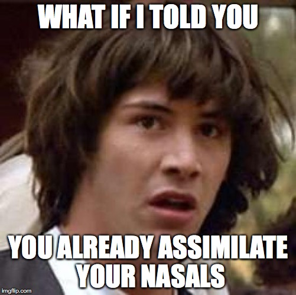
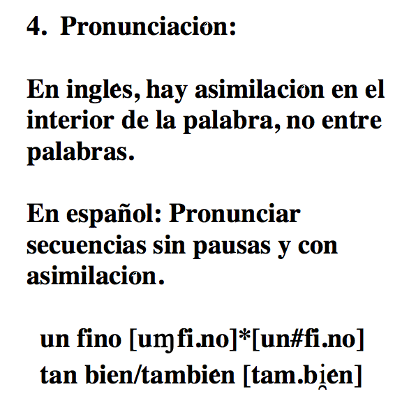
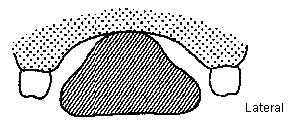

## Repaso

  
  

### /f, x/

>- ¿Cuáles son los problemas de pronunciación que presentan estos dos fonemas para el no nativo?
- ¿Presentan algún otro tipo de problema?

### La sonorización

>- ¿Qué es el proceso de sonorización?
- ¿Cuáles son los sonidos afectados?
- Con un compañero pensad en 3 ejemplos relevantes.

--- .segue bg:grey

# Más procesos de asimilación

--- .segue bg:black

  

 

# Las nasales

---

## Los fonemas nasales

  

- /m/: nasal, **bilabial**, sonora
- /n/: nasal, **alveolar**, sonora
- /ɲ/: nasal, **palatal**, sonora

---

## Los fonemas nasales

### Son fonemas, hay pares mínimos

 

|    Principio de palabra    |                                        |     |    Interior de palabra     |                                        |
| :------------------------- | :------------------------------------- | :-- | :------------------------- | :------------------------------------- |
| **m**apa/**n**apa/**ñ**apa | /ˈ**m**a.pa/ /ˈ**n**a.pa/ /ˈ**ɲ**a.pa/ |     | ca**m**a/ca**n**a/ca**ñ**a | /ˈka.**m**a/ /ˈka.**n**a/ /ˈka.**ɲ**a/ |

---

## Los fonemas nasales

### ¡Los fonemas /n/ y /m/ tienen en total 7^* alófonos! 

\* Las variedades peninsulares suelen tener 8

---

## Los fonemas nasales

### ¡Los fonemas /n/ y /m/ tienen en total 7^* alófonos! 

  

---

## Los fonemas nasales

### ¡Los fonemas /n/ y /m/ tienen en total 7^* alófonos! 

  

---

## Las nasales

### La asimilación de las nasales

- Otro tipo de asimilación regresiva
- Cualquier nasal en posición de coda asimila el punto de articulación de la consonante que le sigue

### Ejemplos

- "Un barco"

---

## La asimilación de las nasales

### "Un barco"

- /uN.ˈbaɾ.ko/ → [um.ˈbaɾ.ko]

 

>- El punto de articulación de la consonante /b/ es bilabial. 
- La nasal /n/ asimila el punto de articulación y es realizada como una nasal bilabial [m].

---

## La asimilación nasal

### Ejemplos

| Alófono |    Contexto    |     |    Ejemplo     |           Transcripción fonética           |
| :------ | :------------- | :-: | :------------- | :----------------------------------------- |
| [m]     | C bilabial     |  →  | "un barco"     | [u**m.ˈb**aɾ.ko]                           |
| [ɱ]     | C labiodental  |  →  | "en Finlandia" | [e**ɱ.f**in.ˈlan̪.di̯a]                    |
| [n̟]    | C interdental  |  →  | "un cielo"     | [u**n̟.ˈθ**i̯e.lo]                         |
| [n̪]    | C dental       |  →  | "en Finlandia" | [eɱ.fin.ˈla**n̪.d**i̯a]                    |
| [n]     | C alveolar     |  →  | "ansiedad"     | [a**n.s**i̯e.ˈðað]                         |
| [ɳ]     | C alveopalatal |  →  | "ancho"        | [ˈa**ɳ.ʧ**o]                               |
| [ɲ]     | C palatal      |  →  | "inyección"    | [i**ɲ.ʝ**ek.ˈθi̯on] o [i**ɲ.dʒ**ek.ˈθi̯on] |
| [ŋ]     | C velar        |  →  | "tengo"        | [ˈte**ŋ.g**o]                              |

---

## Las nasales

<iframe width="560" height="315" src="http://soundsofspeech.uiowa.edu/spanish/spanish.html" frameborder="0" allowfullscreen></iframe>

---

## La asimilación nasal

### Recordad

- Hay resilabificación cuando una nasal va seguida de una vocal (el encandenamiento)
  - 'con una' → [ko.nu.na]
- Una secuencia de dos nasales seguidas puede reducirse a una
  - 'inmediato' → [im.me.ˈdi̯a.to] o [i.me.ˈdi̯a.to]
  - 'gimnasio' → [xim.ˈna.si̯o], [xin.ˈna.si̯o] o [xi.ˈna.si̯o]

<!-- 

  

 -->

---

## La asimilación nasal

  
  

### Pronunciación

>- En inglés hay asimilación en el interior de palabra, pero no entre palabras
  - 'pond' → [p^(h)ɑnd]
  - 'pong' → [p^(h)ɑŋ]
  - 'palm frawn' → [p^(h)ɑ<BLUE>m</BLUE>.<BLUE>f</BLUE>ɹɑn] vs. \*~~[p^(h)ɑɱ.fɹɑn]~~
- El angloparlante tiene que pronunciar las secuencias sin pausas y con asimilación
  - 'en fin' → [e**ɱ**.ˈ**f**i.n]
  - 'tan bien/también' → [ta**m**.ˈ**b**i̯en]

<!-- 

  

 -->

---

## A practicar

### Transcribid las siguientes frases (variedad latinoamericana)

- tengo diez dardos
- eran pobres y desamparados
- enfatizar lo bueno
- envilecer dando voces
- un garaje bien colocado

---

## A practicar

### Transcribid las siguientes frases (variedad latinoamericana)

- tengodiezdardos
- eranpobresydesamparados
- enfatizarlobueno
- envilecerdandovoces
- ungarajebiencolocado

---

## A practicar

### Transcribid las siguientes frases (variedad latinoamericana)

>- /ˈteN.go.ˈdi̯es.ˈdar.dos/
- /ˈe.ɾaN.ˈpo.bɾe.si.de.saN.pa.ˈɾa.dos/
- /eN.fa.ti.ˈsaɾ.lo.ˈbu̯e.no/
- /eN.bi.le.ˈseɾ.ˈdaN.do.ˈbo.ses/
- /uN.ga.ˈɾa.xe.ˈbi̯eN.ko.lo.ˈka.do/

---

## A practicar

### Transcribid las siguientes frases (variedad latinoamericana)

>- /ˈteN.go.ˈdi̯es.ˈdar.dos/  
  [ˈteŋ.go.ˈði̯ez.ˈðaɾ.ðos]
- /ˈe.ɾaN.ˈpo.bɾe.si.de.saN.pa.ˈɾa.dos/  
  [ˈe.ɾam.ˈpo.βɾe.si.ðe.sam.pa.ˈɾa.ðos]
- /eN.fa.ti.ˈsaɾ.lo.ˈbu̯e.no/  
  [eɱ.fa.ti.ˈsaɾ.lo.ˈβu̯e.no]
- /eN.bi.le.ˈseɾ.ˈdaN.do.ˈbo.ses/  
  [em.bi.le.ˈseɾ.ˈðan̪.do.ˈβo.ses]
- /uN.ga.ˈɾa.xe.ˈbi̯eN.ko.lo.ˈka.do/  
  [uŋ.ga.ˈɾa.xe.ˈβi̯eŋ.ko.lo.ˈka.ðo]

---

## Resumen

|    Fonema   |    Alófono    |    Punto     |    Ejemplo     |    Transcripción fonética   |
| :---------- | :------------ | :----------- | :------------- | :-------------------------- |
| /m/ inicial | [m] + vocal   | bilabial     | Mamá, cama     |                             |
| /n/ inicial | [n] + vocal   | alveolar     | Carne, nada    |                             |
| /ɲ/ inicial | [ɲ] + vocal   | palatal      | Caña, ñoña     |                             |

---

## Resumen

|    Fonema   |    Alófono    |    Punto     |    Ejemplo     |    Transcripción fonética   |
| :---------- | :------------ | :----------- | :------------- | :-------------------------- |
| /m/ inicial | [m] + vocal   | bilabial     | Mamá, cama     |                             |
| /n/ inicial | [n] + vocal   | alveolar     | Carne, nada    |                             |
| /ɲ/ inicial | [ɲ] + vocal   | palatal      | Caña, ñoña     |                             |
|             |               |              |                |                             |
|             | [m] + /p,b/   | bilabial     | "un barco"     | [u**m**.ˈ**b**ar.ko]        |
|             | [ɱ] + /f/     | labiodental  | "en Finlandia" | [e**ɱ**.**f**in.ˈlan̪.di̯a] |
|             | [n̟] + /θ/    | interdental  | "en cielo"     | [u**n̟**.ˈ**θ**i̯e.lo]      |
| /N/ final   | [n̪] + /t,d/  | dental       | "en Finlandia" | [eɱ.fin.ˈla**n̪**.**d**i̯a] |
| de sílaba   | [n] + /s,l,r/ | alveolar     | "ansiedad"     | [a**n**.**s**i̯e.ˈðað]      |
|             | [ɳ] + /ʧ/     | alveopalatal | "ancho"        | [ˈa**ɳ**.**ʧ**o]            |
|             | [ɲ] + /ʝ,ɲ/   | palatal      | "inyección"    | [i**ɲ**.**ʝ**ek.ˈsi̯on]     |
|             | [ŋ] + /k,g,x/ | velar        | "tengo"        | [ˈte**ŋ**.**g**o]           |

---

## Resumen

### PARA LAS TRANSCRIPCIONES:

>- Nasales al principio de sílaba/palabra:
  - sólo pueden ser 3: /m,n,ɲ/ → [m,n,ɲ]
- Nasales al final de sílaba (posición de coda) o palabra:
  - transcripción fonológica: ARCHIFONEMA /N/
  - transcripción fonética: el alófono que corresponda según el punto de articulación de la siguiente consonante

--- .segue bg:black

  

       

# Las laterales

---

## Las laterales

<!-- 

  

 -->

### En general, sólo hay un fonema

- /l/: lateral, alveolar, sonora

---

## Las laterales

### Es un fonema, hay pares mínimos

 

| Principio de palabra |                           |     | Interior de palabra |                           |
| :------------------- | :------------------------ | :-- | :------------------ | :------------------------ |
| **l**ata/**p**ata    | /ˈ**l**a.ta/ /ˈ**p**a.ta/ |     | pa**l**a/pa**n**a   | /ˈpa.**l**a/ /ˈpa.**n**a/ |

---

## Las laterales

<!-- 

  

 -->

### En general, sólo hay un fonema

- /l/: lateral, alveolar, sonora

### Pero algunas variedades cuentan con otro...

- /ʎ/: lateral, **palatal**, sonora

---

## Las laterales

### Son fonemas, hay pares mínimos

 

|     Principio de palabra    |                                       |     |     Interior de palabra     |                                        |
| :-------------------------- | :------------------------------------ | :-- | :-------------------------- | :------------------------------------- |
| **l**ama/**ll**ama/**m**ama | /ˈ**l**a.ma/ /ˈ**ʎ**a.ma/ /ˈ**m**a.ma |     | ca**l**a/ca**ll**a/ca**m**a | /ˈka.**l**a/ /ˈka.**ʎ**a/ /ˈka.**m**a/ |

---

## Las laterales

### La asimilación de las laterales

- En posición de coda, la lateral asume el punto de articulación de la consonante siguiente en algunos casos...

### Ejemplos

| Alófono |    Contexto    |     |  Ejemplo   | Transcripción fonética |
| :------ | :------------- | :-: | :--------- | :--------------------- |
| [l̟]    | C interdental  |  →  | "alce"     | [ˈa**l̟.θ**e]          |
| [l̪]    | C dental       |  →  | "saldo"    | [ˈsa**l̪.d**o]         |
| [l]     | C alveolar     |  →  | "al salir" | [a**l.s**a.ˈliɾ]       |
| [ɭ]     | C alveopalatal |  →  | "colchón"  | [ko**ɭ.ˈʧ**on]         |
| [ʎ]     | C palatal      |  →  | "el yate"  | [e**ʎ.ˈʝ**a.te]        |

---

## Las laterales

<iframe width="560" height="315" src="http://soundsofspeech.uiowa.edu/spanish/spanish.html" frameborder="0" allowfullscreen></iframe>

---

## Las laterales

### No hay laterales...

- bilabiales
- labiodentales
- velares

### Cuando una lateral va seguida de una consonante bilabial, labiodental o velar se realiza como [l]. ¿Por qué?

>- Intentad hacer una lateral bilabial o labiodental
- ¿y la velar?

---

## Las laterales

### Existen laterales velares, pero no forman parte del español estándar

 

|      Inglés      | Transcripción | Español | Transcripción |
| :--------------- | :------------ | :------ | :------------ |
| <BLUE>[ɬ]</BLUE> |               | **[l]** |               |
| Al               | [æɬ]          | al      | [al]          |
| mill             | [mɪɬ]         | mil     | [mil]         |
| total            | [ˈt^(h)o.ɾɬ]  | total   | [to.ˈtal]     |

---

## Transcribid (variedad peninsular estándar)

- Ellos no tienen que ganar un sueldo más alto para mejorar su nivel de vida.  
- La fonética es dificil y no me gusta para nada.  
- El cielo está muy gris durante esta temporada  
- El chófer era borde con los clientes  
- No compres el hielo  

---

## Transcribid (variedad peninsular estándar)

>- Ellos no tienen que ganar un sueldo más alto para mejorar su nivel de vida.  
  /ˈe.ʝos.no.ˈti̯e.neN.ke.ga.ˈna.ɾuN.ˈsu̯el.do.ma.ˈsal.to.pa.ɾa.me.xo.ˈɾaɾ.su.ni.ˈbel.de.ˈbi.da/  
  [ˈe.ʝoz.no.ˈti̯e.neŋ.ke.ɣa.ˈna.ɾun.ˈsu̯el̪.do.ma.ˈsal̪.to.pa.ɾa.me.xo.ˈɾaɾ.su.ni.ˈβel̪.de.ˈβi.ða]
- La fonética es dificil y no me gusta para nada.  
  /la.fo.ˈne.ti.ka.es.di.ˈfi.θi.li.no.me.ˈgus.ta.pa.ɾa.na.da/  
  [la.fo.ˈne.ti.ka.ez.ði.ˈfi.θi.li.no.me.ˈɣus.ta.pa.ɾa.na.ða]  
- El cielo está muy gris durante esta temporada  
  /eL.ˈθi̯e.lo.es.ˈta.mui̯.ˈgɾis.du.ˈɾaN.teːs.ta.teN.po.ˈɾa.da/  
  [el̟.ˈθi̯e.lo.es.ˈta.mui̯.ˈgɾiz.ðu.ˈɾan̪.teːs.ta.tem.po.ˈɾa.ða]
- El chófer era borde con los clientes  
  /eL.ˈʧo.fe.ɾe.ɾa.ˈboɾ.de.koN.los.ˈkli̯eN.tes/  
  [eɭ.ˈʧo.fe.ɾe.ɾa.ˈβoɾ.ðe.kon.los.ˈkli̯en̪.tes]
- No compres el hielo  
  /no.ˈkom.pɾe.seL.ˈʝe.lo/  
  [no.ˈkom.pɾe.seʎ.ˈʝe.lo]

---

## Las laterales

  

---

## Las laterales

  

---

## Las laterales

  

---

## Las laterales

  

---

## Los fonemas con un alófono

### ¿Cuáles son los fonemas con solamente un alófono?

- /p/, /t/ y /k/
- /ʧ/
- /ɾ/ y /r/
- /f/ y /x/
- /ɲ/

---

 

  

