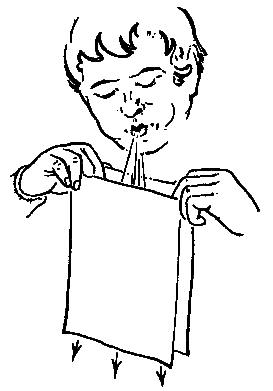
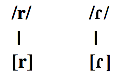
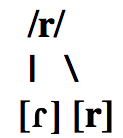

## Fito

### Buscad...

>1. Tres ejemplos de sonorización
2. Tres ejemplos de fricitivización
3. Tres ejemplos en los que la fricativización se bloquee debido a la presencia de una nasal
4. Una nasal dental
5. Una nasal velar
6. Una nasal interdental
7. Una lateral interdental

--- .segue bg:grey

# Las vibrantes (cont.)

---

## Las vibrantes

  

### Hay 2 fonemas vibrantes del español

- /ɾ/: vibrante simple, alveolar, sonora
- /r/: vibrante múltiple, alveolar, sonora

---

## Las vibrantes

- Son fonemas en posición intervocálica
- Hay pares mínimos

 

|     |   Palabra    |       Transcripción       |
| --- | :----------- | :------------------------ |
|     | 'coro/corro' | /ˈko.**ɾ**o/ /ˈko.**r**o/ |
|     | 'pero/perro' | /ˈpe.**ɾ**o/ /ˈpe.**r**o/ |
|     | 'caro/carro' | /ˈka.**ɾ**o/ /ˈka.**r**o/ |

---

## Las vibrantes

### Cada fonema tiene un alófono

 

  

---

## Las vibrantes

### ¡OJO!

- En otras posiciones no hay distinción fonémica
- Se trata de un fonema con dos alófonos

 

  

---

## Las vibrantes - Distribución de alófonos...

### [ɾ]

- En un <BLUE>ataque complejo</BLUE> (ataque compuesto de dos consonantes)
  - 'broma' [ˈb<BLUE>ɾ</BLUE>o.ma]
  - 'tren' [t<BLUE>ɾ</BLUE>en]
  - 'dragón' [d<BLUE>ɾ</BLUE>a.ˈɣon]

---

## Las vibrantes - Distribución de alófonos...

### [r]

- A principio de palabra
  - 'rosa' [ˈ**r**o.sa]
  - 'rojo' [ˈ**r**o.xo]
  - 'roto' [ˈ**r**o.to]
- A principio de sílaba después de /l/, /n/ o /s/
  - 'alrededor' [al.**r**e.ðe.ˈðoɾ]
  - 'Enrique' [en.ˈ**r**i.ke]
  - 'Israel' [is.**r**a.ˈel]

---

## Las vibrantes - Distribución de alófonos...

### [ɾ] / \[r]  (opcional)

- En posición de coda, o posición enfática
  - 'dar' [da<BLUE>ɾ</BLUE>]/[da**r**]
  - 'harto' [a<BLUE>ɾ</BLUE>.to]/[a**r**.to]
  - 'hace un calorrr' [ka.ˈlo<BLUE>ɾ</BLUE>]/[ka.ˈlo**r**]

---

## Las vibrantes - Pronunciación

### /r/ inglés (/ɚ, ɝ, ɹ)

- Es una aproximante ('aproximant')
- La lengua no toca los alvéolos
- La punta de la lengua se vuelve hacia atrás ('retroflex')

### /ɾ/ español

- Se aproxima más al sonido de 'Peter', 'pretty', 'ladder'

### /r/ español

- Como el ruido que hacen los niños cuando juegan a los 'GI Joes'

---

## GI Joe

<iframe width="420" height="315" src="https://www.youtube.com/embed/u8g1D7OFhBY" frameborder="0" allowfullscreen></iframe>

---

## Las vibrantes

<iframe width="560" height="315" src="http://soundsofspeech.uiowa.edu/spanish/spanish.html" frameborder="0" allowfullscreen></iframe>

---

## El efecto Bernoulli

<iframe width="420" height="315" src="https://www.youtube.com/embed/wzL2d1jODzk" frameborder="0" allowfullscreen></iframe>

--- .segue bg:black

  

## Enemigo \#4 - Las vibrantes

# Ejercicios

---

<!-- 

-

# La entonación

-

## La entonación

- .segue bg:grey

# Práctica

-

## Transcribid

- Un cubano canoso cuenta la caña con cuidado
- Concepción Núñez de Los Ángeles tiene un pato nombrado Chencho Núñez.
- Con que te vas inmediatamente a la cabaña para no tener que nadar. 
- El niño Angélico está enfermo. 
- Era un año antes de la independencia del país. 
- Un gringo me mandó un folleto. 
- Muchos de los meʝores estudiantes se esforzaron para poder hacerlo cuanto antes.  

-

## Transcribid

- Uncubanocanosocuentalacañaconcuidado
- ConcepciónNúñezdeLosÁngelestieneunpatonombradoChenchoNúñez.
- Conquetevasinmediatamentealacabañaparanotenerquenadar. 
- ElniñoAngélicoestáenfermo. 
- Eraunañoantesdelaindependenciadelpaís. 
- Ungringomemandóunfolleto. 
- Muchosdelosmeʝoresestudiantesseesforzaronparapoderhacerlocuantoantes

-

## Transcribid

- /ˈuN.ku.ˈba.no.ka.ˈno.so.ˈku̯eN.ta.la.ˈka.ɲa.koN.Ku̯i.ˈda.do/
- /koN.sep.ˈsi̯o.ˈnu.ɲes.de.lo.ˈsaN.xe.les.ˈti̯e.ˈneu̯N.ˈpa.to.noN.ˈbɾa.do.ˈʧeN.ʧo.ˈnu.ɲes/
- /koN.ke.te.ˈba.siN.me.di̯a.ta.ˈmeN.te.a.la.ka.ˈba.ɲa.pa.ɾa.no.te.ˈneɾ.ke.na.ˈdaɾ/
- /el.ˈni.ɲo.aN.ˈxe.li.ko.es.ˈta.eN.ˈfeɾ.mo/
- /ˈe.ɾau̯.ˈna.ɲo.ˈaN.tes.de.lai̯N.de.peN.ˈdeN.si̯a.del.pa.ˈis/
- /uN.ˈgɾiN.go.me.maN.ˈdou̯N.fo.ˈʝe.to/
- /ˈmu.ʧos.de.los.me.ˈxo.ɾe.ses.tu.ˈdi̯aN.te.se:s.foɾ.ˈθa.ɾoN.pa.ɾa.po.ˈde.ɾa.ˈθeɾ.lo.ku̯an.to.an.tes/

-

## Transcribid

- /uN.ku.ˈba.no.ka.ˈno.so.ˈku̯eN.ta.la.ˈka.ɲa.koN.ku̯i.ˈda.do/  
  [uŋ.ku.ˈβa.no.ka.ˈno.so.ˈku̯en̪.ta.la.ˈka.ɲa.koŋ.ku̯i.ˈða.ðo]
- /koN.sep.ˈsi̯o.ˈnu.ɲes.de.lo.ˈsaN.xe.les.ˈti̯e.ˈneu̯N.ˈpa.to.noN.ˈbɾa.do.ˈʧeN.ʧo.ˈnu.ɲes/  
  [kon.sep.ˈsi̯o.ˈnu.ɲez.ðe.lo.ˈsaŋ.xe.les.ˈti̯e.ˈneu̯m.ˈpa.to.nom.ˈbɾa.ðo.ˈʧeɳ.ʧo.ˈnu.ɲes]
- /koN.ke.te.ˈba.siN.me.di̯a.ta.ˈmeN.te.a.la.ka.ˈba.ɲa.pa.ɾa.no.te.ˈneɾ.ke.na.ˈdaɾ/  
  [koŋ.ke.te.ˈβa.sim.me.ði̯a.ta.ˈmen̪.te.a.la.ka.ˈβa.ɲa.pa.ɾa.no.te.ˈneɾ.ke.na.ˈðaɾ]
- /el.ˈni.ɲo.aN.ˈxe.li.ko.es.ˈta.eN.ˈfeɾ.mo/  
  [el.ˈni.ɲo.aŋ.ˈxe.li.ko.es.ˈta.eɱ.ˈfeɾ.mo]
- /ˈe.ɾau̯.ˈna.ɲo.ˈaN.tes.de.lai̯N.de.peN.ˈdeN.si̯a.del.pa.ˈis/  
  [ˈe.ɾaú̯.ˈna.ɲo.ˈan̪.tez.ðe.lai̯n̪.de.pen̪.ˈden.si̯a.ð el.pa.ˈis]
- /uN.ˈgɾiN.go.me.maN.ˈdou̯N.fo.ˈje.to/  
  [uŋ.ˈgɾiŋ.go.me.man̪.ˈdou̯ɱ.fo.ˈʝe.to]
- /ˈmu.ʧos.de.los.me.ˈxo.ɾe.ses.tu.ˈdi̯aN.te.se:s.foɾ.ˈθa.ɾoN.pa.ɾa.po.ˈde.ɾa.ˈθeɾ.lo.ku̯an.to.an.tes/  
  [ˈmu.ʧoz.ðe.loz.me.ˈxo.ɾe.ses.tu.ˈði̯an̪.te.se:s.foɾ.ˈθa.ɾom.pa.ɾa.po.ˈðe.ɾa.ˈθeɾ.lo.ku̯an̪.to.an̪.tes]  
  

 -->

