## Overview

- Purpose/Research questions
- Literature review
- Experimental design
	- Production
	- Percetion
- Preliminary results
- Timeline

--- .segue bg:grey

# Purpose/Research questions

---

## Purpose/Research questions

### Purpose

>- This proposal outlines the rationale and methodology for my dissertation 
research. 
- Explore *what* and *how much* adults are capable of learning in an immersion 
context.
- Explore relationship between production/perception in late learners.

 

### Research Questions

>1. Do late L2 learners acquire the fine phonetic detail of the Spanish stop 
contrast system in a short-term immersion context?
2. What is the nature of the L2 representations acquired in each context?
3. Does production drive perception (or vice versa) in L2 learning?

--- .segue bg:grey

# Literature review

---

## L2 learning

- L1/L2 phonetic interference research suggests that native-like L2 ultimate 
attainment is difficult/uncommon
	- For both production/perception
	- Early learners and even simultaneous bilinguals
- Native-like abilities associated with...
	- AOA
	- AOE
	- L1/L2 use
	- Access to native input
- Grim outlook for most late learners (with exceptions)
- Very grim outlook for typical U.S college students

---

## Advanced late learners

- Some late learners do appear to be native-like, atleast in some respects
	- Bonagearts
	- somebody else
- Multple factors appear to be correlated with L2 mastery

---

## Stop contrasts

  

--- .segue bg:grey

# Experimental design

---

## Participants

- 10 native English speakers
- hi
- age:

---

<iframe src="../../experiments/0_demoQuest/graphs/participantsMap.html" width=100% height=100% allowtransparency="true"> </iframe>

---

## Materials

### Overview

- 2 questionnaires
- 4 experiments

### Production

- Shadowing/Visual word recall administered weekly
- Visual picture recall: administed post program

### Perception

- 2AFC (a): ba/pa administered weekly
- 2AFC (b): bafri/pafri administered post program in two sessions

### Metrics

- VOT, but also burst properties and vowel formants for future research

---

## Questionnaires

### Demographic questionnaire

- hi

### Assessment questionnaire

- hi

---

## Experimental design

  

--- .segue bg:black

# Production

<!-- 

  

 -->

---

## Production

  
  

### Description

- Production experiments provide data regarding the nature of the LLs ongoing acquisition of the Spanish stop contrasts and the Spanish vowel system. 

### Questions

1. Does LLs production change at the end of the program from the week 0 initial state?
2. Do they acquire the Spanish stop contrast system? 
3. Does their Spanish production compare to that of native bilinguals?
4. What is the relationship between production/perception in L2 adquistion in LLs?

### Stimuli

- audio recordings, visual word stimuli, visual picture stimuli

---

## Production 1 - Shadowing/reading

  
  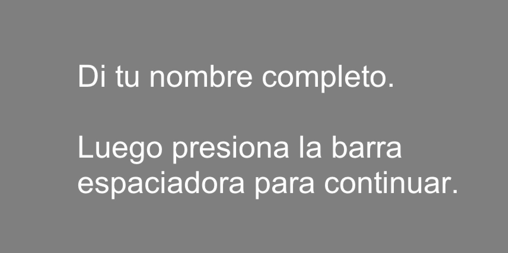  
     
  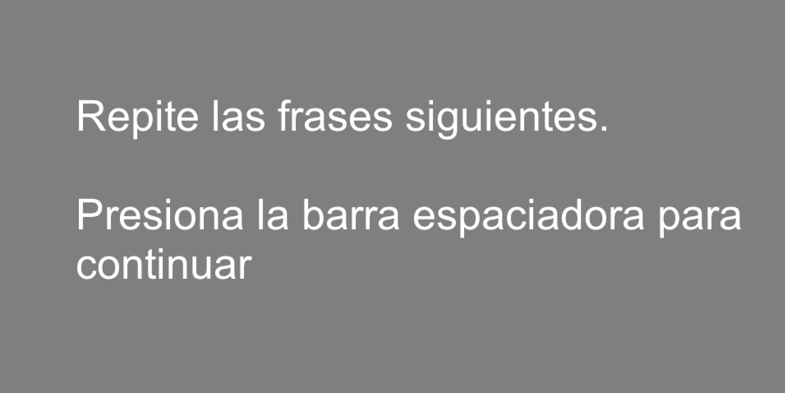  
    
  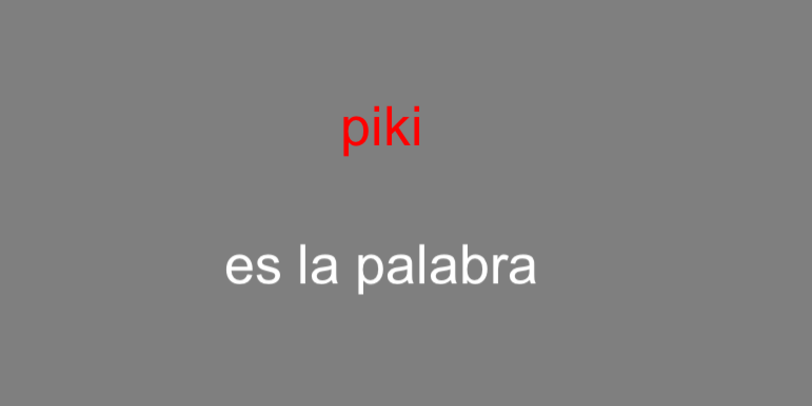  
    
  <audio controls>
  <source src="./assets/img/piki.ogg" type="audio/ogg">
  <source src="./assets/img/piki.wav" type="audio/mpeg">
  Your browser does not support the audio element.
  </audio>

### Word list

- Spanish stops /p, t, k, b, d, g/ in utterance initial position
- Initial stop followed by one of five Spanish vowels and voiceless velar (i.e. /ˈbi.ki/, /ˈbe.ke/, /ˈba.ka/, /ˈbo.ko/, /ˈbu.ku/)
- 30 target productions, 20 distractors (included target words for prod. exp. 2)
- 3 repetitions = 90 tokens per session, 8 sessions = 720 tokens per participant
- Session 0 = shadowing
- Sessions 1-7 read from screen
- Audio recordings produced by native Spanish speaker (Cádiz, Spain)

---

## Production 1 - Shadowing/reading

### Recordings

- Quiet classroom at the site of the immersion program
- Shure SM10A dynamic head-mounted microphone
- Sound Devices MM-1 microphone pre-amplifier
- Marantz PMD661 MKII Solid State Recorder

 

### Analyses: Linear mixed effects models

1. Examine VOT as a function of session for each stop
	- Does stop production vary over time?
2. Examine VOT as a function of group for each stop 
	- Data from session 7
	- Direct comparison with native bilinguals

---

## Production 2 - Picture naming

  
  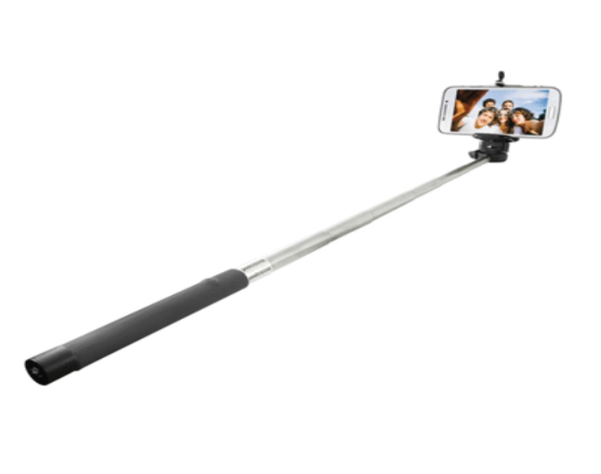  
   
  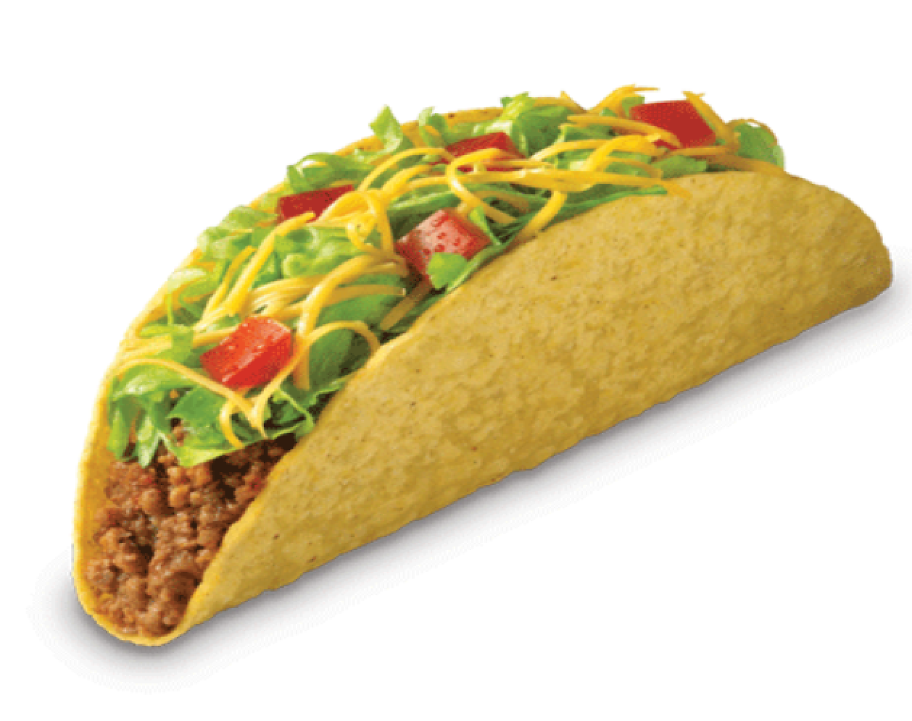  
   
  

### Purpose

- Determine if any measurable differences found in the shadowing task (session 7) remained when the participants were forced to use semantic processing.
	- Does semantic processing hinder VOT production?

### Procedure

- Participants said the word out loud upon recognizing it
- Instructed not to use definite article 

### Pictures

- 20 pictures, 12 included stop in word initial position

--- &twocol

*** {name: left}

Keywords

- **p**alo
- **p**olo
- <BLUE>b</BLUE>ala
- <BLUE>b</BLUE>ola
- **t**aco
- **t**opo
- <BLUE>d</BLUE>ado
- <BLUE>d</BLUE>odo
- **c**aca
- **c**oco
- <BLUE>g</BLUE>ato
- <BLUE>g</BLUE>ota

*** {name: right}

Distractors

- arbol
- lapiz
- libro
- manzana
- mochila
- silla
- sol
- sombrero

---

## Production 2 - Picture naming

  
    
   
    
   
  

### Purpose

- Determine if semantic processing hinders VOT production.

### Procedure

- Participants said the word out loud upon recognizing it
- Instructed not to use definite article 

### Pictures

- 20 pictures, 12 included stop in word initial position

### Analyses

- 12 target words x 3 repititions = 36 tokens per participant
- Linear mixed effects models
- VOT as a function of stimuli type (read vs. picture naming) and stop

---

## Current state

- Data are collected
- Segmenting in progress (about 1/4 finished)

--- .segue bg:black

# Perception

---

## Perception

<!-- 

   
  
  

 -->

### Description

- Perception experiments provide data regarding the nature of the LLs ongoing acquisition of the Spanish stop contrasts. 

### Questions

1. How, if at all, did the LLs identification of Spanish sounds change during/after the immersion program? After how much exposure does perceptual shifting occur?
2. Do LLs come to perceive Spanish stops as native bilinguals? 
3. Do LLs develop new categories for Spanish or merely 'recalibrate' English categories?
4. What is the relationship between production/perception in L2 adquistion in LLs?

### Paradigm

- Two-alternative forced choice identification experiments
- Resynthesized continua of stop contrasts (lead, short-lag, and long-lag VOT)

---

## Perception - 2AFC (a)

### Description

- Categorical perception task that required participants to select identity of resynthesized consonants embedded in a CV environment.
- VOT manipulated to simulate both Spanish and English stop contrast systems.

 

### Questions

1. How, if at all, did the LLs identification of Spanish sounds change during/after the immersion program? After how much exposure does perceptual shifting occur?
2. Do LLs come to perceive Spanish stops as native bilinguals? 

---

## Perception - 2AFC (a)

### Stimuli

- 25-year-old female bilingual English/Spanish speaker of the Southwestern U.S.
- Spanish 'palabra' used as base
- VOT manipulated in 10 ms increments to simulate both Spanish and English stop contrast systems
- 13-step /ba/-/pa/ continuum (-60 ms to 60 ms)

<!-- 	- pre-voicing added in 10 ms increments
	- aspiration added in 10 ms increments -->

 

<audio controls>
  <source src="./assets/img/00_pa_hybrid-60.ogg" type="audio/ogg">
  <source src="./assets/img/00_pa_hybrid-60.wav" type="audio/mpeg">
  Your browser does not support the audio element.
</audio>

<audio controls>
  <source src="./assets/img/12_pa_hybrid+60.ogg" type="audio/ogg">
  <source src="./assets/img/12_pa_hybrid+60.wav" type="audio/mpeg">
  Your browser does not support the audio element.
</audio>

---

## Perception - 2AFC (a)

  
  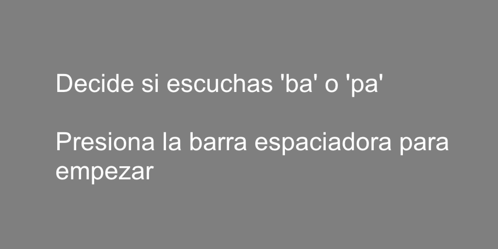  
  
    
  
  

### Procedure

- 2AFC (a) completed every Sunday (after assessment questionnaire) in quiet room
- Participants instructed to choose which sound—'ba' or 'pa'—they thought they had heard as quickly and as accurately as possible using DirectIN rotary controler 
- 'ba' and 'pa' appeared on screen as stimuli presented
- Practice session of 6 trials
- Stimuli from continuum presented 10 times (130 trials total) in 1 randomized block, ISI 500 ms. 
- Approximately 10 minutes

---

## Analyses

- Logistic regression
	- DV: response (/ba/, /pa/)
	- IV: stimuli (-60:60 ms vot)
	- IV: session (0-7)
- Within subjects ANOVA
	- DV: proportion /pa/
	- IV: session (0 vs. 7)
- Linear regression
	- DV: 50% cross over for each participant
	- IV: session (0:7)

---

## Logistic regression

<!-- html table generated in R 3.2.2 by xtable 1.7-4 package -->
<!-- Wed Oct 21 18:14:39 2015 -->
<table border=1>
<tr> <th>  </th> <th> Estimate </th> <th> Std. Error </th> <th> z value </th> <th> Pr(&gt;|z|) </th>  </tr>
  <tr> <td align="right"> (Intercept) </td> <td align="right"> -0.8370 </td> <td align="right"> 0.1124 </td> <td align="right"> -7.44 </td> <td align="right"> 0.0000 </td> </tr>
  <tr> <td align="right"> as.factor(session)1 </td> <td align="right"> 0.2585 </td> <td align="right"> 0.1570 </td> <td align="right"> 1.65 </td> <td align="right"> 0.0997 </td> </tr>
  <tr> <td align="right"> as.factor(session)2 </td> <td align="right"> 0.3939 </td> <td align="right"> 0.1571 </td> <td align="right"> 2.51 </td> <td align="right"> 0.0122 </td> </tr>
  <tr> <td align="right"> as.factor(session)3 </td> <td align="right"> 0.5170 </td> <td align="right"> 0.1573 </td> <td align="right"> 3.29 </td> <td align="right"> 0.0010 </td> </tr>
  <tr> <td align="right"> as.factor(session)4 </td> <td align="right"> 0.4555 </td> <td align="right"> 0.1572 </td> <td align="right"> 2.90 </td> <td align="right"> 0.0038 </td> </tr>
  <tr> <td align="right"> as.factor(session)5 </td> <td align="right"> 0.5416 </td> <td align="right"> 0.1573 </td> <td align="right"> 3.44 </td> <td align="right"> 0.0006 </td> </tr>
  <tr> <td align="right"> as.factor(session)6 </td> <td align="right"> 0.5170 </td> <td align="right"> 0.1573 </td> <td align="right"> 3.29 </td> <td align="right"> 0.0010 </td> </tr>
  <tr> <td align="right"> as.factor(session)7 </td> <td align="right"> 0.7742 </td> <td align="right"> 0.1586 </td> <td align="right"> 4.88 </td> <td align="right"> 0.0000 </td> </tr>
  <tr> <td align="right"> stim </td> <td align="right"> 0.1230 </td> <td align="right"> 0.0027 </td> <td align="right"> 45.80 </td> <td align="right"> 0.0000 </td> </tr>
   </table>

---

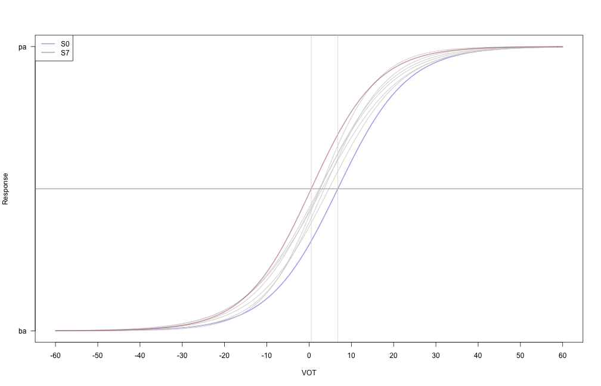

---

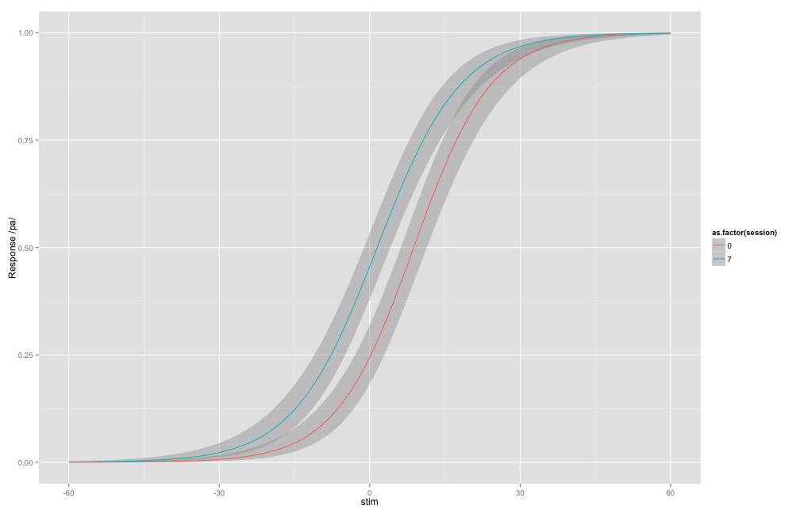

---

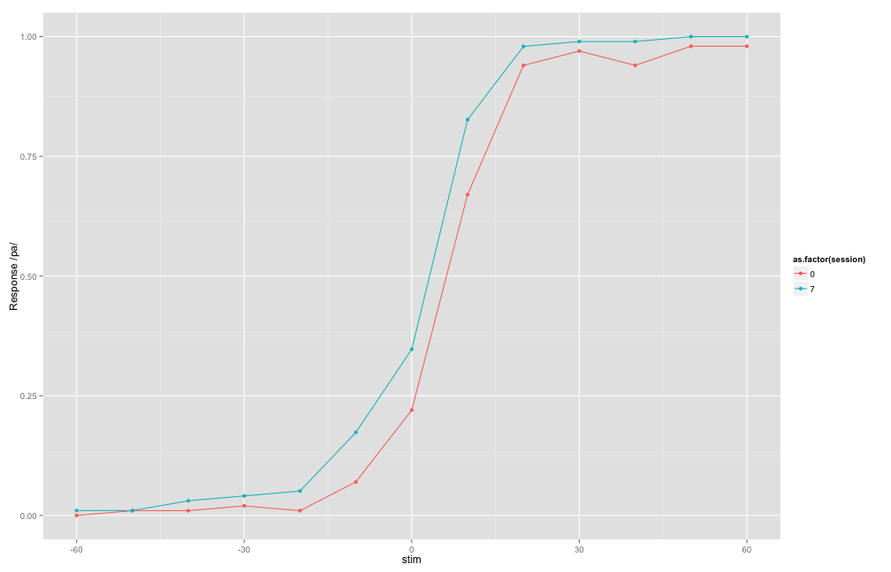

---

## ANOVA

### Proportion of /pa/ responses as a function of stimuli and session

<iframe src="../../experiments/2_2afc/graphs/prop1DT.html" width=100% height=20% allowtransparency="true"> </iframe>

---

## ANOVA

- /pa/ responses varied as a function session (F(,) = XXX; p < XXX)
	- Session 0: 0.448  
	- Session 7: 0.496  

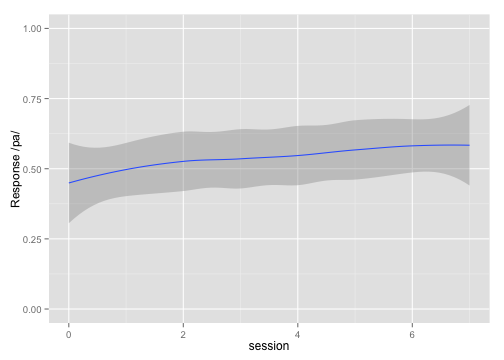

---

## ANOVA

### Proportion of /pa/ responses for 0 and 10 ms VOT

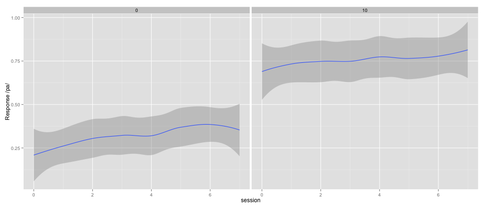

---

## Cross over

- The cross over point decreased by   
0.66 ms ± 0.29 (se) in each session   
(t(9) = -2.23; p < 0.03)

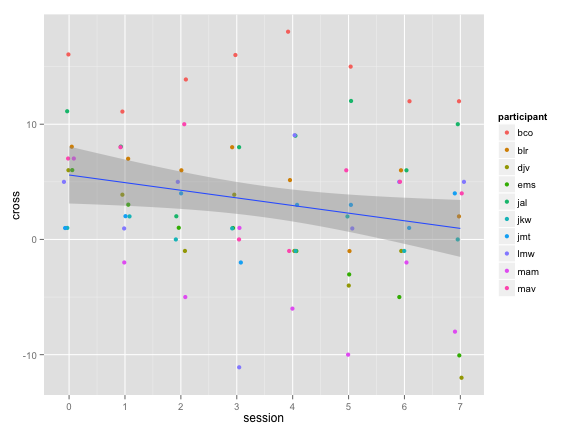

---

## Perception - 2AFC (b)

### Description

- aklfsdja

### Questions

- saldkfj

### Stimuli

2. 2AFC (b): 13-step /bafri/-/pafri/ and 13-step /bafri/-/pafri/ continua

---

---

--- .segue bg:grey

# Timeline

---

## Timeline

### Summer 2015

- ~~Data collection~~
- ~~Preliminary analysis~~

### Fall 2015

- ~~Proposal defense~~
- Article 1

### Spring/Summer 2016

- Article 2
- Article 3

### Fall 2016

- Thesis defense

---

## Articles

1. Article 1
	- info
	- info
2. Article 2
	- info
	- info
3. Article 3
	- info 
	- info

---

## References

- list ehre

